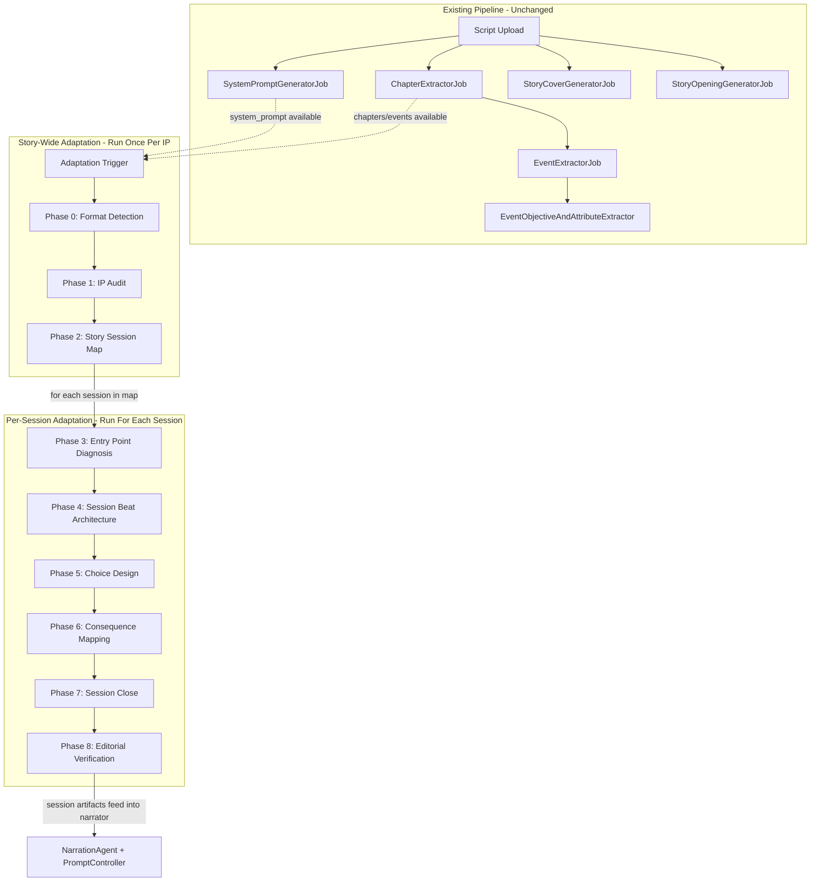

# Adaptation Layer Implementation Plan

## Architecture Overview

The adaptation layer introduces a **production AI pipeline** that runs alongside the existing canon extraction pipeline. It operates at **two tiers**: story-wide phases run once per IP to build a session roadmap, then per-session phases run once for each planned session to fully design it. Completed adaptation artifacts **feed directly into the runtime narrator** so the narrator operates as a director/performer executing pre-designed sessions, not inventing session structure on the fly.




## Key Design Decisions

- **Two-tier storage**: `story_adaptations` table (one row per story) holds story-wide artifacts (format detection, IP audit, story session map). `session_adaptations` table (one row per planned session per story) holds per-session artifacts (entry point, beats, choices, consequences, close, verification). This mirrors the doc's three-layer model (canon / story adaptation / session adaptation).
- **Agent pattern**: Follows the exact existing convention -- implements `Agent`, `HasStructuredOutput`, uses `Promptable` trait, `#[Model('gpt-5.2')]` attribute, Blade templates for prompts.
- **Job pattern**: Follows `ChapterExtractorJob` convention -- `ShouldQueue`, `Queueable`, story constructor, dedicated queue name, try/catch with status rollback.
- **Pipeline orchestration**: `RunAdaptationPipelineJob` dispatches story-wide phases as a chain. After Phase 2 (Story Session Map) completes, it dispatches per-session phase chains for each session in the map -- Session 1 first, then Session 2, etc.
- **Prompt source of truth**: All Blade prompt templates are sourced **verbatim** from the [Change-logic-companion.md](Adaptation%20layer/Change-logic-companion.md) prompt system v1.1. The Master Context Block is a shared partial included in every phase. Per-session prompts use generic "this session" / "next session" language (not hardcoded Session 1/2/3). Phase 8 also receives the Story Session Map for cross-session verification.
- **Runtime integration**: The narration system-prompt Blade template gets a new **additive** `@if` section that injects adaptation context (current beat, designed branching choices, session plan) when available. `PromptController` and `GameController` load the relevant `SessionAdaptation` for the current game session and pass it into the template. **All adaptation data is null-safe**: if no adaptation exists (old stories), the `@if` block is skipped and runtime behaves exactly as before.
- **Branch dimensions**: Defined as canonical narrative axes in Phase 2 (3-6 per story, e.g. `trust_vs_caution`). Phase 5 instantiates them as concrete choices. The dimension registry is seeded from Phase 2's `branch_dimensions` output and enriched when Phase 5 persists choices. This gives runtime a stable vocabulary for classifying freeform input.
- **Runtime branch resolution**: A behavioral contract (not a pipeline phase) that classifies freeform player input as expressive / branch-aligned / emergent candidate / unsupported, resolving in that priority order. Branch-aligned is preferred. Emergent signals are recorded but never silently promoted to canon. This policy is enforced through narrator system-prompt instructions.
- **Runtime state on games**: `branching_choices_taken`, `tracked_dimensions`, and `branch_resolution_log` columns on the `games` table connect Phase 5 tracking to Phase 6 consequence delivery at runtime.
- **Production safety**: Four explicit contracts prevent silent corruption: (1) idempotency on pipeline reruns, (2) transaction boundaries on Phase 2 multi-writes, (3) readiness gate at runtime (presence + COMPLETED status), (4) per-session failure isolation with PARTIAL_COMPLETION story status. See "Production Safety Contracts" section below.
- **Backward compatibility**: Stories without adaptation data continue to work identically. The readiness gate ensures zero regression for any existing story.

---

## Phase Structure (from source docs v1.1)

The pipeline has **two levels** as defined in `Change-logic-companion.md`:

**Story-wide (run once per IP):**

- Phase 0 -- Format Detection: Identify source type (screenplay/novel), protagonist, estimated session count
- Phase 1 -- IP Audit: Score viability on 6 criteria (licensing, choice architecture, bounded agency, emotional range, recognizability, replayability). Verdict: GREEN/AMBER/RED.
- Phase 2 -- Story Session Map: Allocate events to sessions, plan arc progression, map 2-3 branch opportunities per session, build cross-session payoff plan, **define 3-6 canonical branch dimensions** (reusable narrative axes like `trust_vs_caution` that all downstream phases and runtime reference)

**Per-session (run once for each session in the Story Session Map):**

- Phase 3 -- Entry Point Diagnosis: Find the cut point for this session, write the cold open in second-person present tense, state emotional promise
- Phase 4 -- Session Beat Architecture: Map this session's five beats (Setup, Escalation, Breath, Twist, Resolution), build beat map table with time slots and choice slots, confirm next-session awareness
- Phase 5 -- Choice Design: Write all choices for this session -- 3 branching (identity, moral-weight, session-end hook) + 2-4 expressive. Each branching choice **instantiates** a Phase 2 branch dimension (or explicitly declares a new one). **Hard validation rule**: a branching choice is not valid unless its `what_this_choice_tracks` resolves to a registered dimension in the branch dimension registry.
- Phase 6 -- Downstream Consequence Mapping: Map each branching choice forward (immediate effect, current session echo, next session payoff, later session legacy) + validation checks (specificity, asymmetry, payability). **Consistency rule**: every consequence map's `tracked_dimension` must resolve to the same registered dimension used by the originating Phase 5 branching choice. Drift between Phase 5 and Phase 6 artifacts is a validation failure.
- Phase 7 -- Session Close and Retention Hook: Write resolution prose, hook transition, session-end choice with next-session openings, run stickiness audit (payoff test, return driver test, overnight test)
- Phase 8 -- Editorial Verification: 10-question quality gate checklist against full session design + Story Session Map. Production gate: 10/10 = GREEN, 8-9 = AMBER, 7 or below = RED.

---

## Files to Create

### 1. Database

**Migration 1**: `database/migrations/YYYY_MM_DD_create_story_adaptations_table.php`

- `id`, `story_id` (FK to stories, unique), `adaptation_status` (string, default `pending`)
- 3 nullable `longText` JSON columns for story-wide artifacts: `format_detection`, `ip_audit`, `story_session_map`
- `timestamps`

**Migration 2**: `database/migrations/YYYY_MM_DD_create_session_adaptations_table.php`

- `id`, `story_adaptation_id` (FK to story_adaptations), `session_number` (integer)
- `session_status` (string, default `pending`)
- 6 nullable `longText` JSON columns for per-session artifacts: `entry_point_diagnosis`, `session_architecture`, `session_choice_design`, `choice_consequence_map`, `session_close_design`, `editorial_verification`
- `timestamps`
- Unique constraint on `(story_adaptation_id, session_number)`

**Model**: `app/Models/StoryAdaptation.php`

- `belongsTo(Story::class)`, `hasMany(SessionAdaptation::class)`
- 3 JSON casts: `format_detection`, `ip_audit`, `story_session_map`
- Cast `adaptation_status` to `AdaptationStatusEnum`

**Model**: `app/Models/SessionAdaptation.php`

- `belongsTo(StoryAdaptation::class)`
- 6 JSON casts: `entry_point_diagnosis`, `session_architecture`, `session_choice_design`, `choice_consequence_map`, `session_close_design`, `editorial_verification`
- Cast `session_status` to `SessionAdaptationStatusEnum`

**Enum**: `app/Enums/Adaptation/AdaptationStatusEnum.php`

- Cases: `PENDING`, `FORMAT_DETECTION`, `IP_AUDIT`, `STORY_SESSION_MAP`, `ADAPTING_SESSIONS`, `COMPLETED`, `PARTIAL_COMPLETION`, `FAILED`

**Enum**: `app/Enums/Adaptation/SessionAdaptationStatusEnum.php`

- Cases: `PENDING`, `ENTRY_POINT_DIAGNOSIS`, `SESSION_ARCHITECTURE`, `CHOICE_DESIGN`, `CONSEQUENCE_MAPPING`, `SESSION_CLOSE`, `EDITORIAL_VERIFICATION`, `COMPLETED`, `FAILED`

**Migration 3**: `database/migrations/YYYY_MM_DD_add_session_number_to_events_table.php`

- Add `session_number` (nullable unsigned integer) column to `events` table
- This is the **runtime join column** defined in change-logic.md Section 6. Written once by `StorySessionMapJob` when Phase 2 finalizes the event-to-session allocation. Null means the story has not been through the adaptation pipeline yet.

**Migration 4**: `database/migrations/YYYY_MM_DD_add_adaptation_state_to_games_table.php`

- Add nullable columns to `games` table for runtime state: `current_session_number` (unsigned integer), `current_beat_type` (string), `branching_choices_taken` (longText/JSON), `tracked_dimensions` (longText/JSON), `branch_resolution_log` (longText/JSON)
- These connect Phase 5 choice tracking, Phase 6 consequence delivery, and the runtime branch resolution policy

**Event model update**: Add `session_number` to [Event.php](app/Models/Event.php) phpdoc. Optionally add a `sessionAdaptation()` **convenience helper** that encapsulates the join for simple call sites:

```php
public function sessionAdaptation(): ?SessionAdaptation
{
    if ($this->session_number === null) {
        return null;
    }
    return SessionAdaptation::query()
        ->whereHas('storyAdaptation', fn ($q) => $q->where('story_id', $this->chapter->story_id))
        ->where('session_number', $this->session_number)
        ->first();
}
```

**Hard rule**: this helper must NOT be used on production runtime hot paths (`PromptController`, `GameController`). Those paths use the explicit inline query with readiness gate documented in Section 5. The helper is approved only for non-hot-path contexts: Filament admin views, debugging, seeders, and one-off scripts. If a code review sees `->sessionAdaptation()` in a controller that serves player traffic, it is a rejection.

**Story relationship**: Add `adaptation()` hasOne to [Story.php](app/Models/Story.php) (single line, non-breaking)

### 2. Agents (9 new files)

All under `app/Ai/Agents/Adaptation/`:

**Story-wide agents:**

- `FormatDetectionAgent` -- Temp 0.4, Timeout 120s
  - Input: First ~5 pages of script text
  - Output: `detected_format`, `evidence`, `narrative_tense`, `protagonist_name`, `genre_signals`, `estimated_reading_time_per_page`, `total_estimated_source_duration`, `estimated_session_count`
  - **Prompt source**: "FORMAT DETECTION" section of [Change-logic-companion.md](Adaptation%20layer/Change-logic-companion.md) lines 46-91
- `IpAuditAgent` -- Temp 0.4, Timeout 180s
  - Input: Script sections (opening 30 pages, midpoint 30 pages, final 20 pages) + format detection output
  - Output: 6 criterion objects (score + evidence each), `total_score`, `verdict`, `lowest_scoring_criterion`, `editorial_mitigation`
  - **Prompt source**: "PHASE 1 PROMPT -- IP AUDIT" section, lines 118-200
- `StorySessionMapAgent` -- Temp 0.5, Timeout 240s
  - Input: IP audit output + format detection + extracted chapters with positions/titles + extracted events with positions/titles/objectives + estimated session count
  - Output: `session_allocation` (array of sessions with chapter/event ranges, dramatic questions, emotional registers), `arc_progression`, `branch_opportunities` (per session, 2-3 each with event refs), `cross_session_payoff_plan`, `branch_dimensions` (3-6 canonical narrative axes, each with `dimension_name` + `description`), `confirmed_session_count`
  - **Prompt source**: "PHASE 2 PROMPT -- STORY SESSION MAP" section, lines 202-322 (5 tasks: session allocation, arc progression, branch opportunities, cross-session payoff plan, branch dimension definitions)

**Per-session agents:**

- `EntryPointDiagnosisAgent` -- Temp 0.6, Timeout 120s
  - Input: Story Session Map (this session's allocation) + IP audit + session source pages
  - Output: `editorial_diagnosis`, `format_specific_cut`, `cold_open` (second-person prose, 120-180 words), `emotional_promise`
  - **Prompt source**: "PHASE 3 PROMPT -- ENTRY POINT DIAGNOSIS" section, lines 292-375
- `SessionArchitectureAgent` -- Temp 0.6, Timeout 180s
  - Input: Story Session Map (this session + arc context) + Phase 3 output + session source pages
  - Output: 5 beat identifications (source moment, qualification, editorial intervention level), session beat map table (time slots with beat types/choice types), next-session awareness confirmation
  - **Prompt source**: "PHASE 4 PROMPT -- SESSION BEAT ARCHITECTURE" section, lines 377-461
- `ChoiceDesignAgent` -- Temp 0.7, Timeout 240s
  - Input: Phase 4 beat map + Story Session Map (cross-session payoff awareness + **branch dimensions**) + protagonist core trait + emotional promise + choice-moment source pages
  - Output: Branching Choice #1 (identity, setup beat), Expressive Choices (2-3, escalation/breath), Branching Choice #2 (moral weight, twist beat), Branching Choice #3 (session-end hook, resolution beat). **Validation rule**: a branching choice is invalid unless `what_this_choice_tracks` resolves to a registered dimension from Phase 2 (or explicitly declares a new one that is appended to the registry)
  - **Prompt source**: "PHASE 5 PROMPT -- CHOICE DESIGN" section, lines 496-645
- `ConsequenceMappingAgent` -- Temp 0.6, Timeout 180s
  - Input: Phase 5 branching choices + Story Session Map (cross-session payoff plan) + protagonist core trait
  - Output: 3 consequence maps (immediate effect, current session echo, next session payoff, later session legacy -- per path A/B/C) + validation results (specificity, asymmetry, payability)
  - **Prompt source**: "PHASE 6 PROMPT -- DOWNSTREAM CONSEQUENCE MAPPING" section, lines 614-690
- `SessionCloseAgent` -- Temp 0.7, Timeout 180s
  - Input: Phase 5 Branching Choice #3 design + Phase 6 Choice #3 consequence map + resolution source pages + this session's primary goal
  - Output: Resolution prose (120-200 words, second-person), hook transition, session-end choice with next-session openings, stickiness audit (3 checks: payoff, return driver, overnight)
  - **Prompt source**: "PHASE 7 PROMPT -- SESSION CLOSE AND RETENTION HOOK" section, lines 692-778
- `EditorialVerificationAgent` -- Temp 0.3, Timeout 120s
  - Input: Complete session design (all per-session phase outputs 3-7 in order) + Story Session Map (cross-session verification)
  - Output: 10 question verdicts (PASS/REVISE with details), total passing count, production status (GREEN/AMBER/RED), revision instructions
  - **Prompt source**: "PHASE 8 PROMPT -- EDITORIAL VERIFICATION CHECKLIST" section, lines 780-882

Each follows the exact pattern in [NarrationAgent.php](app/Ai/Agents/NarrationAgent.php): `implements Agent, HasStructuredOutput`, `use Promptable`, custom `instructions()` from Blade view, `schema()` with `JsonSchema`.

### 3. Prompt Templates (18 new Blade files + 1 shared partial)

Under `resources/views/ai/agents/adaptation/`:

**Shared partial (included in every phase system-prompt):**

- `_master-context.blade.php` -- The "LORESPINNER MASTER CONTEXT" block from the companion doc (lines 96-117). Contains the 4 immovable laws, session structure (5 beats with time windows), and slots for `{{ $formatDetectionOutput }}` and `{{ $currentPhase }}`.

**Per-phase templates (system-prompt = phase instructions; prompt = story data injection):**

- `format-detection/system-prompt.blade.php` + `prompt.blade.php`
  - Source: Companion doc lines 50-91 (FORMAT DETECTION prompt -- step 1 format indicators + output format)
  - Prompt vars: `$scriptExcerpt` (first ~5 pages)
- `ip-audit/system-prompt.blade.php` + `prompt.blade.php`
  - Source: Companion doc lines 124-200 (PHASE 1 -- 6 criteria with scoring rubrics + scorecard output)
  - Prompt vars: `$formatDetection`, `$title`, `$author`, `$year`, `$format`, `$openingPages`, `$midpointPages`, `$closingPages`
- `story-session-map/system-prompt.blade.php` + `prompt.blade.php`
  - Source: Companion doc lines 208-322 (PHASE 2 -- 5 tasks: session allocation, arc progression, branch opportunities, cross-session payoff plan, **branch dimension definitions**)
  - Prompt vars: `$ipAudit`, `$formatDetection`, `$chapters`, `$events`, `$estimatedSessionCount`
- `entry-point-diagnosis/system-prompt.blade.php` + `prompt.blade.php`
  - Source: Companion doc lines 298-375 (PHASE 3 -- 4 tasks: diagnose opening, format-specific cut, write cold open, emotional promise)
  - Prompt vars: `$storySessionMap`, `$ipAudit`, `$sessionNumber`, `$sessionSourcePages`
- `session-architecture/system-prompt.blade.php` + `prompt.blade.php`
  - Source: Companion doc lines 377-461 (PHASE 4 -- 3 tasks: identify 5 beats, build beat map table, next session awareness)
  - Prompt vars: `$storySessionMap`, `$entryPointDiagnosis`, `$sessionSourcePages`
- `choice-design/system-prompt.blade.php` + `prompt.blade.php`
  - Source: Companion doc lines 496-645 (PHASE 5 -- 4 tasks: branching #1, expressive choices, branching #2 moral weight, branching #3 session-end hook + 8 choice writing rules). Each branching choice must reference Phase 2 branch dimensions.
  - Prompt vars: `$beatMap`, `$storySessionMap` (includes `branch_dimensions`), `$protagonistCoreTrait`, `$emotionalPromise`, `$choiceMomentPages`
- `consequence-mapping/system-prompt.blade.php` + `prompt.blade.php`
  - Source: Companion doc lines 614-690 (PHASE 6 -- 3 consequence maps + 3 validation checks)
  - Prompt vars: `$branchingChoices`, `$storySessionMap`, `$protagonistCoreTrait`
- `session-close/system-prompt.blade.php` + `prompt.blade.php`
  - Source: Companion doc lines 692-778 (PHASE 7 -- 3 tasks: resolution prose, session-end hook, stickiness audit)
  - Prompt vars: `$branchingChoice3Design`, `$choice3ConsequenceMap`, `$resolutionSourcePages`, `$sessionPrimaryGoal`
- `editorial-verification/system-prompt.blade.php` + `prompt.blade.php`
  - Source: Companion doc lines 780-882 (PHASE 8 -- 10 questions + production status verdict)
  - Prompt vars: `$completeSessionDesign`, `$storySessionMap`

### 4. Jobs (11 new files)

Under `app/Jobs/Adaptation/`:

**Orchestrator:**

- `RunAdaptationPipelineJob.php` -- Enforces the **idempotency contract** (see Production Safety Contracts below), then creates/resets `StoryAdaptation` row and dispatches story-wide chain (P0 -> P1 -> P2). After P2 completes and determines session count, creates `SessionAdaptation` rows and dispatches per-session chains for each planned session.

**Story-wide jobs (one per story):**

- `FormatDetectionJob.php` -- Reads script, calls `FormatDetectionAgent`, saves to `story_adaptations.format_detection`
- `IpAuditJob.php` -- Reads script sections + format output, calls `IpAuditAgent`, saves to `story_adaptations.ip_audit`
- `StorySessionMapJob.php` -- Reads chapters/events/audit/format, calls `StorySessionMapAgent`, then **inside a DB::transaction**: saves `story_session_map`, batch-updates `events.session_number`, and creates `session_adaptations` rows. Dispatches per-session chains after the transaction commits.

**Per-session jobs (one per session):**

- `EntryPointDiagnosisJob.php` -- Saves to `session_adaptations.entry_point_diagnosis`
- `SessionArchitectureJob.php` -- Saves to `session_adaptations.session_architecture`
- `ChoiceDesignJob.php` -- Saves to `session_adaptations.session_choice_design`
- `ConsequenceMappingJob.php` -- Saves to `session_adaptations.choice_consequence_map`
- `SessionCloseJob.php` -- Saves to `session_adaptations.session_close_design`
- `EditorialVerificationJob.php` -- Saves to `session_adaptations.editorial_verification`, marks session status `COMPLETED`

**Finalizer:**

- `AdaptationStatusReconciliationJob.php` -- Dispatched after all per-session chains. Queries all `session_adaptations` rows for the story, computes aggregate status (`COMPLETED` / `PARTIAL_COMPLETION` / `FAILED`), writes it to `story_adaptations.adaptation_status`. This is the single point of truth for story-level adaptation status.

All on queue `adaptation`. Each phase job:

1. Updates the relevant status column to its phase enum value
2. Loads required data (script, chapters, events, previous phase artifacts)
3. Calls its agent with rendered Blade prompt (system-prompt includes master context partial)
4. Saves the structured JSON result to the appropriate column
5. On failure: sets status to `FAILED`, throws (but does NOT block other sessions -- see Production Safety Contract 4)

### 5. Runtime Integration (production, guarded)

This is the bridge described in change-logic.md sections 9-10. The adaptation artifacts feed into the narrator so it operates as a **director and performer**, not a session architect.

**The runtime join path** (from change-logic.md Section 6):

```
game.current_event_id
  → event.session_number          (nullable int, written by StorySessionMapJob)
    → session_adaptations WHERE   story_adaptation.story_id = event.chapter.story_id
                            AND   session_number = event.session_number
```

If `event.session_number` is null (story not adapted), skip the lookup entirely. This is the single join that makes the entire runtime integration work. No range queries, no position arithmetic.

**Changes to PromptController** ([app/Http/Controllers/User/Game/PromptController.php](app/Http/Controllers/User/Game/PromptController.php)):

- In `renderSystemPrompt()`: after loading `$currentEvent`, perform an explicit query to resolve the `SessionAdaptation` row. Do not use the convenience helper on this hot path:

```php
$sessionAdaptation = null;

if ($currentEvent->session_number !== null) {
    $sessionAdaptation = SessionAdaptation::query()
        ->whereHas('storyAdaptation', fn ($q) => $q->where('story_id', $story->id))
        ->where('session_number', $currentEvent->session_number)
        ->first();

    if ($sessionAdaptation?->session_status !== SessionAdaptationStatusEnum::COMPLETED) {
        $sessionAdaptation = null;
    }
}
```

Pass the result as `$sessionAdaptation` to the Blade template. The `generateNarration()` and `buildConversationHistory()` methods remain unchanged.

**Changes to GameController** ([app/Http/Controllers/User/GameController.php](app/Http/Controllers/User/GameController.php)):

- In `generateFirstNarration()`: same explicit query pattern -- resolve `SessionAdaptation` for `$firstEvent->session_number` with the readiness gate, pass to the system-prompt view.

**Changes to narration system-prompt Blade** ([resources/views/ai/agents/narration/system-prompt.blade.php](resources/views/ai/agents/narration/system-prompt.blade.php)):

Add a new **adaptation readiness gate** block after the existing event context sections. The gate checks both presence AND completeness:

```
@if(!empty($sessionAdaptation) && $sessionAdaptation->session_status === \App\Enums\Adaptation\SessionAdaptationStatusEnum::COMPLETED)
```

This prevents the narrator from receiving incomplete choice designs, missing consequence maps, or half-built sessions. When the gate passes, inject:

- Current session number and beat type (from `session_architecture`)
- Whether the current turn is at a branching choice slot or expressive choice slot
- The pre-authored branching choice definition if one is active (from `session_choice_design`)
- Consequence hooks that must remain available (from `choice_consequence_map`)
- Session close design awareness if near the resolution beat

When `$sessionAdaptation` is null, or when `session_status` is not `COMPLETED` (in-progress, failed, or partial sessions), the gate block is skipped entirely and the narrator falls back to canon-only context -- exactly as it works today.

**StorySessionMapJob write-back**: When `StorySessionMapJob` saves the story session map, it also writes `session_number` to each `events` row based on the event-to-session allocation in the map. This is a batch update -- one query per session, updating all events whose positions fall within that session's allocated event range. **All three writes (session map, events, session rows) happen inside a single `DB::transaction`** (see Production Safety Contracts).

**Backward compatibility guarantee**: The entire chain is null-safe. `event.session_number` defaults to `null`. `Event::sessionAdaptation()` returns `null` when `session_number` is null. The Blade adaptation readiness gate checks both presence AND `session_status === COMPLETED`. Runtime behavior for unadapted stories, failed sessions, or in-progress sessions is identical to today.

**Branch dimension registry**: The runtime needs a concrete registry of branch dimensions to classify freeform player input against. This registry is:

- **Seeded from Phase 2**: `story_session_map.branch_dimensions` provides `dimension_name` + `description` (origin: `phase_2`)
- **Enriched by Phase 5**: When `ChoiceDesignJob` persists choices, it appends `possible_paths` (A/B/C meanings), `session_introduced`, and `choice_id` to each dimension. If Phase 5 declares a new dimension not in Phase 2, it is appended with origin: `phase_5`. **Write authority rule**: the registry update is performed by `ChoiceDesignJob` in normalized job code, not left as freeform agent text. The job must match the agent's declared dimension name against existing registry entries (case-insensitive, underscore-normalized) to prevent near-duplicates like `trust_vs_caution` and `caution_vs_trust`.
- **Stored on**: `story_adaptations.story_session_map` JSON (the `branch_dimensions` array grows as sessions are adapted)

Registry row structure:

- `dimension_name` (string) -- e.g. `trust_vs_caution`
- `description` (string) -- Phase 2 canonical definition
- `possible_paths` (JSON) -- Phase 5 A/B/C meanings
- `origin` (string) -- `phase_2` or `phase_5`
- `session_introduced` (int) -- which session first uses this dimension
- `choice_id` (string) -- reference to the Phase 5 branching choice

**Runtime branch resolution policy** (from change-logic.md Section 11 and companion doc "RUNTIME BRANCH RESOLUTION POLICY"):

This is a **runtime behavioral contract**, not a pipeline phase. When the player submits freeform input that does not exactly match a predesigned choice, the narrator classifies and resolves it in this priority order:

1. **Expressive** -- changes tone/delivery/texture only. No durable continuity change. Kept local to narration.
2. **Branch-aligned** -- novel wording but functionally matches an existing branch dimension. Maps to nearest valid predesigned branch path. Uses existing consequence map. **Preferred behavior.**
3. **Emergent candidate** -- meaningful continuity shift that fits no existing dimension. Recorded as an entry in `branch_resolution_log` with `input_classification: "emergent_candidate"` (plus session_number, event_id, player_input, detected_dimension=null, mapped_to_existing_branch=false, requires_editorial_review=true). Local consequence preserved when safe. No downstream promises. Never silently promoted to canon.
4. **Unsupported** -- cannot become durable branch, cannot map to existing dimension. Folded into nearest safe outcome. Player intent acknowledged. Scene reacts meaningfully. Outcome remains compatible with session roadmap.

This policy is enforced through the narration system-prompt instructions when `$sessionAdaptation` is present. The classification logic and dimension registry are injected into the narrator's context so it can match freeform input against known dimensions.

**Runtime state requirements** (from change-logic.md Section 6 and companion doc "Runtime State Requirements"):

These fields must be persisted per game session. They connect Phase 5 (what choices track), Phase 6 (what consequences depend on), and runtime (what must be remembered turn to turn):

- `current_session_number` (integer) -- derived from `event.session_number`, cached on `games`
- `current_beat_type` (enum: setup/escalation/breath/twist/resolution) -- **derived** on each turn from the current event position mapped against the Phase 4 beat map (source of truth). Cached on `games` for convenience, but the session architecture artifact is canonical. If the cache is stale, the beat map wins.
- `branching_choices_taken` (JSON map: choice_id -> A/B/C) -- recorded when player picks a branching choice
- `tracked_dimensions` (JSON map: dimension_name -> object) -- dimensions defined in Phase 2, instantiated by Phase 5 choices. Each entry has the canonical shape:

```json
{
  "trust_vs_caution": {
    "selected_path": "B",
    "choice_id": "S1_C1",
    "session_number": 1
  }
}
```

This richer structure ties each tracked dimension to the specific choice and session that instantiated it, which is required for debugging, consequence delivery across sessions, and future analytics. A flat `dimension_name -> path` map would lose the provenance needed when multiple sessions touch the same dimension.

- `branch_resolution_log` (JSON array of structured entries) -- records every runtime branch resolution decision across all four classification types (expressive, branch_aligned, emergent_candidate, unsupported). Emergent candidates in this log feed the future promotion path.

These fields are added as nullable JSON/integer columns on the `games` table. `branching_choices_taken` and `tracked_dimensions` are the bridge that makes Phase 6 consequence maps payable at runtime. `branch_resolution_log` provides both debugging observability and the data source for emergent-to-formal dimension promotion.

### 6. Filament Integration

**Creator `CreateStory`**: After existing jobs are dispatched (when `use_script_upload` is true), also dispatch `RunAdaptationPipelineJob` with a 2-minute delay to let chapter extraction finish first.

**Creator `ViewStory`**: New "Run Adaptation" header action button (visible when story has chapters but no completed adaptation, or when adaptation failed). Also a "Re-run Adaptation" action when adaptation exists but needs refresh.

**Creator `StoryInfolist`**: Show adaptation status (with severity color badge) and per-session statuses when available.

### 7. Process Log

- `Adaptation layer/PROCESS_LOG.md` -- Written at the end documenting all changes.

---

## Production Safety Contracts

These are not conceptual guidelines -- they are execution contracts that prevent silent data corruption in production.

### 1. Idempotency Contract (on `RunAdaptationPipelineJob`)

The pipeline can be triggered multiple times (Filament button, retry after failure, re-run after content update). Without idempotency, this produces duplicate sessions, corrupted event mappings, and inconsistent runtime joins.

**Contract**: `RunAdaptationPipelineJob` must check existing state before acting:

```php
$adaptation = $story->adaptation;

if ($adaptation && $adaptation->adaptation_status === AdaptationStatusEnum::COMPLETED) {
    if (! $this->force) {
        return; // already complete, skip unless force flag is set
    }
}

// If forcing rerun or if previous run failed/partial:
if ($adaptation) {
    DB::transaction(function () use ($adaptation, $story) {
        $adaptation->sessionAdaptations()->delete();

        // Clear session_number for all events belonging to this story.
        // Story already has events() defined as hasManyThrough(Event::class, Chapter::class)
        // in the existing codebase — no new relationship needed.
        $story->events()->update(['session_number' => null]);

        $adaptation->update([
            'format_detection' => null,
            'ip_audit' => null,
            'story_session_map' => null,
            'adaptation_status' => AdaptationStatusEnum::PENDING,
        ]);
    });
}
```

The `$force` flag is passed from the Filament "Re-run Adaptation" action. First-run triggers (from `CreateStory`) never set force. The reset is atomic -- it clears session_adaptations, resets events.session_number, and nulls story-wide artifacts in one transaction.

### 2. Transaction Boundaries (on `StorySessionMapJob`)

Phase 2 does three related writes: saves the story session map JSON, batch-updates `events.session_number`, and creates `session_adaptations` rows. If any of these fails independently, runtime has broken joins (events mapped to sessions that don't exist, or sessions without mapped events).

**Contract**: All three writes happen inside a single `DB::transaction`:

```php
DB::transaction(function () use ($sessionMap, $storyAdaptation, $story) {
    $storyAdaptation->update([
        'story_session_map' => $sessionMap,
        'adaptation_status' => AdaptationStatusEnum::STORY_SESSION_MAP,
    ]);

    foreach ($sessionMap['sessions'] as $session) {
        // batch update events in this session's range
        Event::query()
            ->whereIn('id', $eventIdsForSession)
            ->update(['session_number' => $session['session_number']]);

        // create session_adaptations row
        $storyAdaptation->sessionAdaptations()->create([
            'session_number' => $session['session_number'],
            'session_status' => SessionAdaptationStatusEnum::PENDING,
        ]);
    }
});

// dispatch per-session chains AFTER transaction commits
```

Per-session job chains are dispatched **after** the transaction commits, not inside it. This ensures the rows they depend on exist before the jobs run.

### 3. Adaptation Readiness Gate (at runtime)

Checking `!empty($sessionAdaptation)` alone is not sufficient. A session can exist in the table but be in-progress (Phase 4 done, Phase 5 not yet), which means the narrator would receive an incomplete beat map with no choice definitions. This breaks coherence.

**Contract**: The narration system-prompt Blade uses a strict gate:

```
@if(!empty($sessionAdaptation) && $sessionAdaptation->session_status === \App\Enums\Adaptation\SessionAdaptationStatusEnum::COMPLETED)
```

This ensures the narrator only receives adaptation context from fully completed sessions. Incomplete, in-progress, or failed sessions are treated as if they don't exist -- the narrator falls back to canon-only context.

The same gate applies in `PromptController` and `GameController` when deciding whether to pass `$sessionAdaptation` to the view at all. Controllers perform the readiness check inline as part of the explicit query (see Section 5), not via the convenience helper.

### 4. Per-Session Failure Policy

If one session's adaptation fails (e.g. Phase 5 AI call times out), the behavior must be defined. Without a policy, a single session failure either blocks all other sessions or silently produces a gap.

**Contract**:

- If a per-session phase job fails: mark that `session_adaptations` row as `FAILED`. Do NOT block other sessions from being adapted.
- Other sessions continue their chains independently.
- **Finalizer mechanism**: `StorySessionMapJob` dispatches all per-session chains, then dispatches an `AdaptationStatusReconciliationJob` as the **final job in the chain** (after all per-session chains). This job queries all `session_adaptations` rows for the story and computes the final story-level status:
  - All sessions `COMPLETED` -> `AdaptationStatusEnum::COMPLETED`
  - Some sessions `COMPLETED`, some `FAILED` -> `AdaptationStatusEnum::PARTIAL_COMPLETION`
  - All sessions `FAILED` -> `AdaptationStatusEnum::FAILED`
- The reconciliation job is dispatched using `Bus::chain()` with an `afterAll` callback, or as the terminal job in a `Bus::batch()`. It does not run until every per-session chain has either completed or failed.
- **Precondition**: `PARTIAL_COMPLETION` is only reachable if all story-wide phases (0, 1, 2) completed successfully. If Phase 2 fails, no session rows exist, so the reconciliation job is never dispatched -- the story stays `FAILED`. A story cannot be `PARTIAL_COMPLETION` without a valid story session map.
- At runtime: failed sessions are handled by the readiness gate (Contract 3). The narrator falls back to canon-only context for events in failed sessions. Completed sessions work normally.
- In Filament: `PARTIAL_COMPLETION` shows as a warning badge. The "Re-run Adaptation" button becomes available. Individual session retry is a future enhancement.

---

## Files to Modify

- [app/Models/Story.php](app/Models/Story.php) -- Add `adaptation()` hasOne relationship + import. Risk: None, additive method.
- [app/Models/Event.php](app/Models/Event.php) -- Add `sessionAdaptation()` helper method + `session_number` to phpdoc. Risk: None, additive method; column is nullable with null default.
- [resources/views/ai/agents/narration/system-prompt.blade.php](resources/views/ai/agents/narration/system-prompt.blade.php) -- Add `@if(!empty($sessionAdaptation))` block with adaptation context. Risk: None -- block is skipped when data is absent.
- [app/Http/Controllers/User/Game/PromptController.php](app/Http/Controllers/User/Game/PromptController.php) -- In `renderSystemPrompt()`, load and pass `$sessionAdaptation`. Risk: Low -- null-safe query, existing behavior preserved when null.
- [app/Http/Controllers/User/GameController.php](app/Http/Controllers/User/GameController.php) -- In `generateFirstNarration()`, load and pass `$sessionAdaptation`. Risk: Low -- same null-safe pattern.
- [app/Filament/Creator/Resources/Stories/Pages/CreateStory.php](app/Filament/Creator/Resources/Stories/Pages/CreateStory.php) -- Dispatch `RunAdaptationPipelineJob` after existing jobs. Risk: None, additive.
- [app/Filament/Creator/Resources/Stories/Pages/ViewStory.php](app/Filament/Creator/Resources/Stories/Pages/ViewStory.php) -- Add "Run Adaptation" action button. Risk: None, additive header action.
- [app/Filament/Creator/Resources/Stories/Schemas/StoryInfolist.php](app/Filament/Creator/Resources/Stories/Schemas/StoryInfolist.php) -- Show adaptation status if present. Risk: None, guarded by null check.

---

## What Will NOT Be Changed

- `NarrationAgent` PHP class -- zero modifications (its schema stays: response, choices, advance_event)
- Existing extractor agents (Chapter, Event, Objective/Attribute) -- zero modifications
- Existing enums (`StoryStatusEnum`, `ChapterStatusEnum`) -- zero modifications
- Existing jobs -- zero modifications
- Existing migration files -- zero modifications
- The narration prompt.blade.php (user message template) -- zero modifications
- Core runtime flow (turn loop, advance logic, 5-turn cap, fallback responses) -- zero modifications

## Files to Modify (additive, non-breaking)

Note: The "Files to Modify" section above also lists [app/Models/Game.php](app/Models/Game.php) implicitly via the games migration. The Game model will need JSON casts for `branching_choices_taken`, `tracked_dimensions`, and `branch_resolution_log`, plus an integer cast for `current_session_number`. All nullable, all additive.

---

## Implementation Order

The work proceeds in 8 incremental steps, each leaving the codebase in a working state:

1. **Database + Models + Enums** -- 4 migrations (story_adaptations, session_adaptations, add session_number to events, add runtime state to games), 2 models, 2 enums, Story + Event + Game model updates
2. **Agents** -- 9 agent classes with schemas
3. **Prompt Templates** -- 18 Blade files + master context partial, verbatim from companion doc
4. **Jobs** -- 9 phase jobs + orchestrator (with idempotency contract, transaction boundaries, failure isolation)
5. **Runtime Integration** -- narration system-prompt adaptation injection block, PromptController/GameController loading with readiness gate
6. **Filament Integration** -- CreateStory dispatch, ViewStory run/re-run button, StoryInfolist status
7. **Verify + Lint** -- backward compatibility, imports, namespaces, null-safety
8. **Process Log** -- PROCESS_LOG.md in Adaptation layer directory

---

## Day-One Inclusions (High-Leverage, Low-Cost)

These are not "future work" -- they cost almost nothing to add during initial implementation but save significant debugging and iteration time later.

### Choice ID Convention

Every branching choice output from Phase 5 must include a stable `choice_id` in the format `S{session}_C{choice_number}` (e.g. `S1_C1`, `S1_C2`, `S1_C3`, `S2_C1`). This is enforced in the `ChoiceDesignAgent` schema and referenced by:

- `branching_choices_taken` on `games` (maps choice_id to A/B/C)
- `tracked_dimensions` (links dimension_name to the choice_id that instantiated it)
- `choice_consequence_map` (references which choice each map belongs to)
- `branch_dimension_registry` (links each dimension to its originating choice_id)

Without stable IDs, all cross-references between Phase 5, Phase 6, runtime state, and analytics become fragile string matching.

### Runtime Resolution Logging

Every runtime branch resolution decision is logged as a structured entry in the `games.branch_resolution_log` JSON array. This logs all four classification types, not just emergent candidates. The canonical entry shape is:

```json
{
  "event_id": 123,
  "session_number": 1,
  "input_classification": "branch_aligned",
  "player_input": "I test him before trusting him",
  "matched_dimension": "trust_vs_caution",
  "selected_path": "B",
  "mapped_to_existing_branch": true,
  "requires_editorial_review": false,
  "timestamp": "2026-04-15T12:00:00Z"
}
```

Field semantics by classification type:

- **expressive**: `matched_dimension` = null, `selected_path` = null, `mapped_to_existing_branch` = false, `requires_editorial_review` = false
- **branch_aligned**: all fields populated, `mapped_to_existing_branch` = true, `requires_editorial_review` = false
- **emergent_candidate**: `matched_dimension` = null or best-guess, `selected_path` = null, `mapped_to_existing_branch` = false, `requires_editorial_review` = true
- **unsupported**: `matched_dimension` = null, `selected_path` = null, `mapped_to_existing_branch` = false, `requires_editorial_review` = false

This is the canonical shape. Engineering should not add or rename fields without updating this spec. The log provides immediate debugging capability for "why did this consequence not trigger?" and "why did this map to that dimension?" -- questions that will arise within the first week of production use.

---

## Future-Proofing (Post-Launch Enhancements)

These are explicitly scoped out of the current production implementation. They are documented here so architectural decisions made now do not block them later.

### Adaptation Versioning

Currently reruns replace adaptation artifacts. This is the correct production behavior. Post-launch, add `version` (integer) and `is_active` (boolean) columns to `story_adaptations`. Reruns create a new version and mark the old one inactive. Runtime always queries `is_active = true`. This unlocks safe iteration, editor comparison (old vs new adaptation side by side), rollback, and future A/B testing of session designs.

**Why not now**: Adds complexity to every query and the idempotency contract. The current "reset and replace" approach is correct until there is a real need for version comparison.

### Precomputed Runtime Payload

Currently runtime pulls full session JSON blobs and extracts what it needs in the Blade template. Post-launch, add an optional `runtime_payload` JSON column on `session_adaptations`, built once after Phase 8 completes. Contains a flattened, pre-extracted structure:

```json
{
  "branching_choices": [...],
  "dimension_refs": [...],
  "beat_sequence": [...],
  "consequence_hooks": [...]
}
```

**Why deferred**: The Blade template approach handles current production scale. The precomputed payload becomes valuable when prompt assembly latency matters (high concurrency) or when the JSON blobs grow large enough that traversal cost is measurable.

---

## The Critical Last Mile: Narration Adaptation Injection

Everything above builds the pipeline and the data. The system's actual quality hinges on one thing: **how the narrator sees and uses adaptation context without breaking immersion**.

The core principle:

> The narrator knows the rails exist but speaks like it does not.

The narration system-prompt adaptation block (added to `narration/system-prompt.blade.php` inside the readiness gate) must solve three problems simultaneously:

**1. What the narrator sees** (injected when `$sessionAdaptation` is COMPLETED):

- Current session number and beat type (Setup / Escalation / Breath / Twist / Resolution)
- Whether this turn is at a branching choice slot, an expressive choice slot, or neither
- If at a branching slot: the pre-authored choice definition (question, A/B/C options, what it tracks, downstream effects)
- Active branch dimensions with player's current path values (from `games.tracked_dimensions`)
- Consequence hooks that must remain available for future sessions (from `choice_consequence_map`)
- The branch resolution policy classification rules (expressive / branch-aligned / emergent / unsupported)

**2. What the narrator must NOT do** (constraints injected alongside the context):

- Must not leak future consequences or session-end hooks before their designed moment
- Must not name beat types, session numbers, or structural terminology in prose
- Must not rigidly present branching choices as a list when the moment calls for organic narration leading to the question
- Must not refuse player actions that don't match a predesigned choice -- must classify and resolve per the branch resolution policy
- Must not alter the designed branching choice options (A/B/C wording is authored, not improvised). **Hard rule**: when a pre-authored branching choice is active, the narrator may vary the lead-in prose to fit the current conversation state, but may not mutate the authored option semantics. The options as written in Phase 5 are the options the player sees. This protects the consequence mapping -- if the semantics shift, the downstream payoffs in Phase 6 become misaligned.

**3. The feel** (behavioral framing):

- When at a branching choice slot: narrate toward the choice question naturally, then present the pre-authored options. The narrative lead-in from Phase 5 is the guide, not a script -- the narrator adapts it to the current conversation state.
- When between choice slots: narrate freely within the current beat's constraints. Generate expressive choices when appropriate. Stay within the beat's emotional register.
- When the player goes off-script: classify (expressive / branch-aligned / emergent / unsupported), resolve, and continue. Acknowledge the player's action. Never break flow.

This block is the literal difference between a structured chatbot and a real interactive narrative system. It is implemented as part of Step 5 (Runtime Integration).