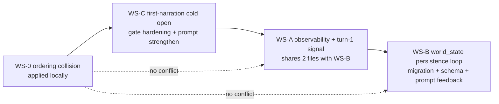

# Curt Fix Execution Plan

## Rollback anchor

- **Pre-WS-0 SHA (rollback target):** `6dd6fa943a23cecb709e61367205c4cca69bd26a` — captured from `git log -1` before any of our edits land. Recorded at the top of the process log so a single `git reset --hard 6dd6fa9` reverts the entire fix series.

## What changed since the previous plan revision

User clarifications on 2026-04-26 (recorded here so the diff against `curt-feedback-fix.md` is auditable):

1. **WS-C redirected.** Alice's `stories.opening` was added manually and stays. Curt's "preamble feels stylistically wrong" maps to the **first NarrationAgent response** (the cold-open delivery), not the Lorespinner welcome preamble. The cold-open block is *already* wired into the first-narration system prompt at `[resources/views/ai/agents/narration/system-prompt.blade.php](resources/views/ai/agents/narration/system-prompt.blade.php)` lines 233–248 — gated by `$isSessionStart && $sessionAdaptation->entry_point_diagnosis`. The defect is one (or more) of: gate logic dropping the block silently, or the existing prose softening the cold open into generic cinematic voice. WS-C now targets *that* path. `StoryOpeningGeneratorJob`, opening-narration views, `AdaptationStatusReconciliationJob`, and `GameOpeningNarration.vue` are out of scope.
2. **WS-B `state_delta` redesigned, not minimized.** User wants real persisted world state — inventory (with nesting like backpack→phone), conditions, location, knowledge, relationships, branching path, flags — anything that should affect later turns. This is now a materialized column (`games.world_state`) updated every turn, surfaced back to the narrator. The MVP fix from the original `curt-feedback-fix.md` is replaced by the design in §"Batch 3" below.

## Batch sequencing rationale

Dependency analysis across the four workstreams:

- **WS-0** (Game::prompts ordering) — touches `[app/Models/Game.php](app/Models/Game.php)` + `[app/Http/Controllers/User/GameController.php](app/Http/Controllers/User/GameController.php)`. Conflicts with nothing. Already applied locally.
- **WS-C** (first-narration cold open) — touches `[app/Http/Controllers/User/GameController.php](app/Http/Controllers/User/GameController.php)` (`generateFirstNarration`) and `[resources/views/ai/agents/narration/system-prompt.blade.php](resources/views/ai/agents/narration/system-prompt.blade.php)` (the `isSessionStart` block). Shares one file with WS-0 (GameController) and one with WS-A/B (system-prompt.blade), at non-overlapping insertion sites.
- **WS-A** (observability + first-turn signal) — touches `[app/Http/Controllers/User/Game/PromptController.php](app/Http/Controllers/User/Game/PromptController.php)`, `GameController.php`, `system-prompt.blade.php`, new `GameTraceCommand`, `config/logging.php`.
- **WS-B** (state persistence) — touches `[app/Ai/Agents/NarrationAgent.php](app/Ai/Agents/NarrationAgent.php)`, `PromptController.php`, the same `system-prompt.blade.php` (WORLD STATE block), `[resources/views/ai/agents/narration/prompt.blade.php](resources/views/ai/agents/narration/prompt.blade.php)`, and a new migration adding `games.world_state`.

Shared regions across batches:

- `system-prompt.blade.php` is touched by WS-C (cold-open block strengthening), WS-A (TURN STATE block), and WS-B (WORLD STATE block). All three sites are non-overlapping inserts. Sequencing C → A → B keeps each diff isolated to one concern.
- `PromptController::store()` is touched by WS-A (logging + signal) and WS-B (persistence + detection). Sequenced A → B for the same reason.
- `GameController` is touched by WS-0 (already applied), WS-C (`generateFirstNarration` lookup hardening), and WS-A (`isFirstTurnInEvent` parameter). Sequenced 0 → C → A.




Order: **0 → C → A → B**. WS-C lands the bug Curt actually felt as #6. WS-A then lands the trace + first-turn signal so when WS-B's state loop ships, every state-write is observable in the trace channel.

## The four batches

### Batch 0 — WS-0 (applied, awaiting review)

- One commit, two files. Already covered in `curt-feedback-fix.md` §0.5.
- Commit message references `curt-game-log-review.md` for empirical evidence and `curt-feedback-fix.md` §0.5 for the audit + SQL proof.
- After commit + push: write `Adaptation layer/debug/curt-fix-process-log.md` with rollback SHA, this commit's SHA, and validation steps run.

### Batch 1 — WS-C (first-narration cold open, REDIRECTED)

Single commit. Two stages: investigate, then fix.

#### C-pre — empirical gate check

Before changing code, determine which gate is actually dropping Alice's cold open. Run a one-shot `php -r` script against the booted Laravel kernel:

```php
$story = App\Models\Story::where('slug','alices-adventures-in-wonderland')->first();
$firstChapter = $story->chapters()->orderBy('position')->first();
$firstEvent = $firstChapter?->events()->orderBy('position')->first();
echo "first_event.id="            . ($firstEvent->id ?? 'null') . "\n";
echo "first_event.session_number=" . var_export($firstEvent->session_number ?? null, true) . "\n";

$sa = App\Models\SessionAdaptation::query()
    ->whereHas('storyAdaptation', fn($q) => $q->where('story_id', $story->id))
    ->where('session_number', 1)->first();
echo "session_adaptation.status=" . ($sa?->session_status?->value ?? 'null') . "\n";
echo "cold_open_first_120="
    . substr($sa->entry_point_diagnosis['cold_open'] ?? '', 0, 120) . "\n";
```

This tells us, in 5 seconds, whether the failure is: (a) `firstEvent->session_number` is `null` (so the lookup in `[GameController::generateFirstNarration](app/Http/Controllers/User/GameController.php)` at line 128 short-circuits), (b) `session_status` is not `COMPLETED`, or (c) both gates pass and the cold open is reaching the prompt — which would mean the defect is purely tone-dilution.

The result of C-pre is logged into `curt-fix-process-log.md` and shapes C1.

#### C1 — robust cold-open lookup in `generateFirstNarration`

Today the code in `[app/Http/Controllers/User/GameController.php](app/Http/Controllers/User/GameController.php)` lines 128–137 only attempts the SessionAdaptation lookup when `firstEvent->session_number !== null`:

```php
if ($firstEvent->session_number !== null) {
    $sessionAdaptation = SessionAdaptation::query()
        ->whereHas('storyAdaptation', fn ($q) => $q->where('story_id', $story->id))
        ->where('session_number', $firstEvent->session_number)
        ->first();

    if ($sessionAdaptation?->session_status !== SessionAdaptationStatusEnum::COMPLETED) {
        $sessionAdaptation = null;
    }
}
```

If C-pre reveals `firstEvent->session_number` is `null` for Alice (the most likely cause), broaden the lookup to fall back to **the story's Session 1** when the event itself doesn't carry a session number:

```php
$sessionAdaptation = null;

if ($firstEvent->session_number !== null) {
    $sessionAdaptation = SessionAdaptation::query()
        ->whereHas('storyAdaptation', fn ($q) => $q->where('story_id', $story->id))
        ->where('session_number', $firstEvent->session_number)
        ->where('session_status', SessionAdaptationStatusEnum::COMPLETED)
        ->first();
}

// Fallback: any first event of a story with a completed Session 1 should
// get the Session 1 cold open as its first-narration brief.
if ($sessionAdaptation === null) {
    $sessionAdaptation = SessionAdaptation::query()
        ->whereHas('storyAdaptation', fn ($q) => $q->where('story_id', $story->id))
        ->where('session_number', 1)
        ->where('session_status', SessionAdaptationStatusEnum::COMPLETED)
        ->first();
}
```

If C-pre reveals gate (b) is the cause (status not COMPLETED), the same fallback path still applies — when no completed session is found, the cold open block silently doesn't render and the existing flow runs. That's correct behavior, not a bug.

#### C2 — strengthen the cold-open instruction in `system-prompt.blade.php`

Today the block at lines 233–248 of `[resources/views/ai/agents/narration/system-prompt.blade.php](resources/views/ai/agents/narration/system-prompt.blade.php)` tells the model "use as creative brief, generate your own narration in your voice, do not copy verbatim". This is too soft for the opening: it invites the model to write a generic cinematic intro rather than honor the cold open's voice.

Replace with a rule that distinguishes between *opening* (cold open is the source) and *mid-session* (cold open is creative direction):

```blade
@if(!empty($isSessionStart) && !empty($sessionAdaptation->entry_point_diagnosis))
@php $entryPoint = $sessionAdaptation->entry_point_diagnosis; @endphp
--- SESSION COLD OPEN (PRIMARY SOURCE FOR YOUR FIRST RESPONSE) ---
This is the OPENING of this session. Your first response IS the rendering of the cold open below.

Hard rules for opening rendering:
1. Match the cold open's VOICE, sensory specificity, and rhythm. If the cold open uses second-person present tense with tactile detail, you do too.
2. Preserve every concrete detail (objects, sensations, characters named) verbatim or as close to verbatim as natural prose allows.
3. You may re-segment into <p> paragraphs for HTML formatting and trim to a 2-3 paragraph response, but you MUST NOT substitute generic cinematic phrasing.
4. End at the first natural decision point implied by the cold open (where player agency activates).
5. Do NOT bring in EVENT.text content beyond what the cold open already covers — the cold open IS the directed source for turn 1.

COLD OPEN:
{{ $entryPoint['cold_open'] ?? '' }}

EMOTIONAL PROMISE: {{ $entryPoint['emotional_promise'] ?? '' }}

@if(!empty($entryPoint['format_specific_cut']['must_reintroduce']))
CUT MATERIAL TO REINTRODUCE (weave naturally, never as exposition dump):
{{ $entryPoint['format_specific_cut']['must_reintroduce'] }}
@endif
@endif
```

Key changes vs the existing block:

- "Primary source" not "creative brief".
- Explicit voice/rhythm match rule.
- Verbatim preservation of concrete details.
- Explicit instruction to *not* fall back to `EVENT.text` for the opening (which today causes the model to interleave Carroll's chapter prose alongside its invention, producing the disjoint feeling).

#### C3 — files touched, validation, acceptance

- `[app/Http/Controllers/User/GameController.php](app/Http/Controllers/User/GameController.php)` (`generateFirstNarration` lookup hardening).
- `[resources/views/ai/agents/narration/system-prompt.blade.php](resources/views/ai/agents/narration/system-prompt.blade.php)` (cold-open block rewrite).

Validation:

1. Re-run C-pre's `php -r` script to confirm gates resolve.
2. Render the system prompt for a fresh Alice game without calling the AI: `view('ai.agents.narration.system-prompt', [...])->render()`. Assert the rendered string contains the literal phrase "PRIMARY SOURCE FOR YOUR FIRST RESPONSE" and Carroll's cold-open text ("Heat shimmers off the river stones" or whatever the seeded value is).
3. Spot-play one turn end-to-end. Inspect the AI's first response for: (a) tactile sensory detail, (b) river-stones / sister / page-turning anchors from the cold open, (c) absence of generic openers like "The scene unfolds..." or "Welcome to the story...".

Acceptance gate: if the rendered system prompt does not include the cold open even after C1, do not commit — investigate the gate further. We don't ship a "fix" that doesn't move the marker.

### Batch 2 — WS-A (observability + first-turn signal)

Single commit covering A1 + A2. Unchanged from `curt-feedback-fix.md` §1.

- A1: log channel `narration` in `config/logging.php`; trace call at the bottom of `[PromptController::store()](app/Http/Controllers/User/Game/PromptController.php)`; new `app/Console/Commands/GameTraceCommand.php` asserting the four hard rules per row.
- A2: pass `isFirstTurnInEvent` from `PromptController::renderSystemPrompt()` and `GameController::generateFirstNarration()` (the latter unconditionally `true`). Replace the `@if(!empty($turnCount))` guard at line 216 of `system-prompt.blade.php` with the explicit two-state TURN STATE block from `curt-feedback-fix.md` §A2.
- Validation: fresh Alice game; `php artisan game:trace <id>` shows N rows with all four hard rules green; turn-1 system prompt dump contains "TURN 1 of this event"; turn-3 dump contains "TURN 3 ... screenplay was already narrated".
- Acceptance gate: trace command reports all rules green for at least one full event.

### Batch 3 — WS-B (world_state persistence loop, REDESIGNED)

Single commit covering migration + B1 + B2 + B3 + B4. This batch has its own internal sub-stages because it adds a column.

#### B-pre — design rationale

User explicitly wants real persisted state: "user brings a backpack that has their phone in it, or if they made a choice that needs to affect the story/playout we need to keep track and save". Existing columns on `games` (`branching_choices_taken`, `tracked_dimensions`, `branch_resolution_log`, `current_beat_type`) only cover the choice-design surface. They don't cover narrative-emergent state (objects picked up, conditions, location-within-event, knowledge gained, relationship shifts).

Two storage strategies were considered:

- **Replay-from-log:** derive current state by replaying `branch_resolution_log`. Pros: no migration. Cons: O(N) per turn, harder to debug, inventory queries from elsewhere (Filament, future UI) are awkward.
- **Materialized column:** add `games.world_state` JSON, write the cumulative current state on every turn. Pros: O(1) read, debuggable in Filament/SQL, mirrors the precedent already set by `branching_choices_taken` and `tracked_dimensions`. Cons: one migration; must be careful to keep the materialized view consistent with the log.

Choosing materialized column. The log remains as the audit trail; `world_state` is the runtime view.

#### B0 — migration

New file: `database/migrations/2026_04_26_000001_add_world_state_to_games_table.php`.

```php
Schema::table('games', function (Blueprint $table) {
    $table->json('world_state')->nullable()->after('branch_resolution_log');
});
```

Add `'world_state' => 'json'` to the casts in `[app/Models/Game.php](app/Models/Game.php)`.

Initial value `null` (treated as the empty world). Reset to `null` on `GameController::reset()` (already deletes prompts; add `'world_state' => null` to the update array).

#### B1 — NarrationAgent extended schema

New fields on `[app/Ai/Agents/NarrationAgent.php](app/Ai/Agents/NarrationAgent.php)` `schema()`:

- `**input_classification**` (string, required): one of `expressive`, `branch_aligned`, `emergent`, `unsupported`, `opening`. Mirrors the four categories already in `system-prompt.blade.php` lines 298–304 plus `opening` for turn-1 first-narration.
- `**mapped_choice_id**` (string, required): when `input_classification === 'branch_aligned'` and a pre-authored branching choice slot was active, the choice_id (e.g. `"S1_C1"`). Empty string otherwise.
- `**mapped_option**` (string, required): one of `"A"`, `"B"`, `"C"`, or empty string. Renamed from the original `mapped_option_letter` per user feedback ("letter" leaks implementation detail).
- `**state_delta**` (object, required): structured world-state changes from this turn. See full shape below. Empty values mean "nothing changed in this category".

Full `state_delta` shape (each top-level key is required so the model considers all categories every turn; empty arrays/strings/objects are valid for "no change"):

```jsonc
{
  "objects_acquired": [
    {
      "name": "small bottle",            // canonical noun phrase
      "qualifier": "labelled DRINK ME",  // short state/desc; "" if none
      "contains": []                      // names of nested objects (backpack -> phone); [] if none
    }
  ],
  "objects_lost": ["small bottle"],       // names matching prior acquired objects
  "objects_transformed": [
    { "name": "small bottle", "new_qualifier": "empty" }
  ],
  "conditions_added": [
    { "name": "shrunk", "note": "10 inches tall after drinking" }
  ],
  "conditions_removed": ["wet"],
  "location_changed": "doorway",          // new sub-location within current event; "" if no movement
  "knowledge_gained": [
    "the small door fits the golden key"
  ],
  "relationship_changes": [
    { "character": "white rabbit", "shift": "more agitated" }
  ],
  "tracked_path_update": {
    "curiosity_vs_caution": "A"           // dimension name -> A|B|C; {} if no shift
  },
  "flags_set": ["tried_drink_me_bottle"]
}
```

Naming choices:

- `objects_*` not `inventory_*` — the former is a delta verb, the latter a noun. The cumulative noun lives on `world_state.inventory`.
- `tracked_path_update` not `tracked_dimension_path` — emphasizes "this is a delta" (the cumulative is `world_state.tracked_paths` or persists into the existing `games.tracked_dimensions`).
- `flags_set` (not `flags_added`) — flags are write-once; we never "remove" a flag.

#### B2 — persistence in `PromptController::store()`

After the AI call, apply `state_delta` to `games.world_state` cumulatively:

```php
$worldState = $game->world_state ?? [
    'inventory' => [],            // [{ name, qualifier, contains: [] }]
    'conditions' => [],           // [{ name, note }]
    'current_location' => null,
    'known_facts' => [],          // string[]
    'relationships' => [],        // { character: latest_shift }
    'flags' => [],                // string[]
];

$delta = $aiResult['state_delta'] ?? [];

// Inventory: apply acquired, lost, transformed.
foreach ($delta['objects_acquired'] ?? [] as $obj) {
    $worldState['inventory'][] = [
        'name' => $obj['name'],
        'qualifier' => $obj['qualifier'] ?? '',
        'contains' => $obj['contains'] ?? [],
    ];
}
$worldState['inventory'] = array_values(array_filter(
    $worldState['inventory'],
    fn ($obj) => !in_array($obj['name'], $delta['objects_lost'] ?? [], true)
));
foreach ($delta['objects_transformed'] ?? [] as $tx) {
    foreach ($worldState['inventory'] as &$obj) {
        if ($obj['name'] === $tx['name']) {
            $obj['qualifier'] = $tx['new_qualifier'] ?? $obj['qualifier'];
        }
    }
    unset($obj);
}

// Conditions: add and remove.
foreach ($delta['conditions_added'] ?? [] as $c) {
    $worldState['conditions'][] = ['name' => $c['name'], 'note' => $c['note'] ?? ''];
}
$worldState['conditions'] = array_values(array_filter(
    $worldState['conditions'],
    fn ($c) => !in_array($c['name'], $delta['conditions_removed'] ?? [], true)
));

// Location.
if (!empty($delta['location_changed'])) {
    $worldState['current_location'] = $delta['location_changed'];
}

// Knowledge: append (deduped).
foreach ($delta['knowledge_gained'] ?? [] as $fact) {
    if (!in_array($fact, $worldState['known_facts'], true)) {
        $worldState['known_facts'][] = $fact;
    }
}

// Relationships: latest shift wins per character.
foreach ($delta['relationship_changes'] ?? [] as $rc) {
    $worldState['relationships'][$rc['character']] = $rc['shift'];
}

// Flags: append (deduped, write-once).
foreach ($delta['flags_set'] ?? [] as $flag) {
    if (!in_array($flag, $worldState['flags'], true)) {
        $worldState['flags'][] = $flag;
    }
}

$gameUpdate['world_state'] = $worldState;
```

In the same `store()`, also write the existing structured columns (per `curt-feedback-fix.md` §B2, simplified now that `state_delta` carries the path update):

- `branching_choices_taken[$choiceId] = $option` — driven by deterministic detection in B4 (preferred), falling back to model-emitted `mapped_choice_id` + `mapped_option` if detection misses.
- `tracked_dimensions[$dimName] = ['current_path' => 'A|B|C', 'choice_id' => ..., 'updated_at' => ...]` — driven by `state_delta.tracked_path_update`.
- `branch_resolution_log[]` — append one row per turn capturing classification, mapping, and delta.
- `current_beat_type` — derived via Option a (proportional beat-map mapping); TODO for Option b.

#### B3 — surface `world_state` back into the system prompt

Pass into `renderSystemPrompt()`:

```php
'worldState' => $game->world_state,
'currentBeatType' => $game->current_beat_type,
'trackedDimensions' => $game->tracked_dimensions ?? [],
'branchingChoicesTaken' => $game->branching_choices_taken ?? [],
```

New blade section in `system-prompt.blade.php`, sited right before `=== ADAPTATION LAYER CONTEXT ===` (so persisted state and designed state are adjacent):

```blade
@if(!empty($worldState) || !empty($currentBeatType) || !empty($trackedDimensions) || !empty($branchingChoicesTaken))
=== WORLD STATE (PERSISTED ACROSS TURNS — AUTHORITATIVE) ===

@if(!empty($worldState['inventory']))
The player is carrying:
@foreach($worldState['inventory'] as $obj)
- {{ $obj['name'] }}@if(!empty($obj['qualifier'])) ({{ $obj['qualifier'] }})@endif@if(!empty($obj['contains'])) — contains: {{ implode(', ', $obj['contains']) }}@endif

@endforeach
@endif

@if(!empty($worldState['conditions']))
Active conditions:
@foreach($worldState['conditions'] as $c)
- {{ $c['name'] }}@if(!empty($c['note'])) ({{ $c['note'] }})@endif

@endforeach
@endif

@if(!empty($worldState['current_location']))
Current sub-location within scene: {{ $worldState['current_location'] }}
@endif

@if(!empty($worldState['known_facts']))
Player knows:
@foreach($worldState['known_facts'] as $fact)
- {{ $fact }}
@endforeach
@endif

@if(!empty($worldState['relationships']))
Character dispositions toward the player:
@foreach($worldState['relationships'] as $character => $shift)
- {{ $character }}: {{ $shift }}
@endforeach
@endif

@if(!empty($worldState['flags']))
Flags raised this game: {{ implode(', ', $worldState['flags']) }}
@endif

@if(!empty($currentBeatType))
Current beat: {{ $currentBeatType }}
@endif

@if(!empty($branchingChoicesTaken))
Branching choices taken so far:
@foreach($branchingChoicesTaken as $choiceId => $letter)
- {{ $choiceId }}: option {{ $letter }}
@endforeach
@endif

@if(!empty($trackedDimensions))
Tracked dimensions (player path on each):
@foreach($trackedDimensions as $dimName => $entry)
- {{ $dimName }}: path {{ $entry['current_path'] ?? '?' }} (set at {{ $entry['choice_id'] ?? 'unknown' }})
@endforeach
@endif

These reflect what has actually happened in play. Honor them. Do NOT contradict prior state, do NOT re-acquire objects already in inventory, do NOT re-introduce conditions already active. New deltas must be additive and consistent.
@endif
```

#### B4 — deterministic authored-choice detection

Same as `curt-feedback-fix.md` §B4: in `PromptController::store()`, before the AI call, compare the player prompt against `session_choice_design.branching_choice_*.option_*.text` (with `Str::squish` on both sides). When matched, the runtime knows the deterministic `(choice_id, option)` and overrides whatever the model emits. Inject signal into `[resources/views/ai/agents/narration/prompt.blade.php](resources/views/ai/agents/narration/prompt.blade.php)`.

#### B5 — files touched, validation, acceptance

- New: `database/migrations/2026_04_26_000001_add_world_state_to_games_table.php`.
- `[app/Models/Game.php](app/Models/Game.php)` (cast for `world_state`).
- `[app/Http/Controllers/User/GameController.php](app/Http/Controllers/User/GameController.php)` (reset clears `world_state`).
- `[app/Ai/Agents/NarrationAgent.php](app/Ai/Agents/NarrationAgent.php)` (extended schema).
- `[app/Http/Controllers/User/Game/PromptController.php](app/Http/Controllers/User/Game/PromptController.php)` (persistence + detection).
- `[resources/views/ai/agents/narration/system-prompt.blade.php](resources/views/ai/agents/narration/system-prompt.blade.php)` (WORLD STATE block).
- `[resources/views/ai/agents/narration/prompt.blade.php](resources/views/ai/agents/narration/prompt.blade.php)` (deterministic-choice signal).

Validation (scripted 6-turn Alice playthrough):


| Turn | Player input             | Expected `state_delta` movement                                                                                                | Expected `world_state` after turn            |
| ---- | ------------------------ | ------------------------------------------------------------------------------------------------------------------------------ | -------------------------------------------- |
| 1    | "Examine the bottle"     | `objects_acquired: [{name: 'small bottle', qualifier: 'labelled DRINK ME'}]`                                                   | `inventory` has bottle                       |
| 2    | "Drink it"               | `objects_transformed: [{name: 'small bottle', new_qualifier: 'empty'}]`, `conditions_added: [{name: 'shrunk', note: '...'}]`   | bottle qualifier "empty", condition "shrunk" |
| 3    | "Walk to the door"       | `location_changed: 'doorway'`                                                                                                  | `current_location: 'doorway'`                |
| 4    | (authored A/B/C choice)  | runtime sets `branching_choices_taken[S1_C1] = 'A'`; model emits `tracked_path_update: {curiosity_vs_caution: 'A'}`            | both columns populated                       |
| 5    | "What does the cat say?" | `relationship_changes: [{character: 'cheshire cat', shift: 'amused'}]`, `knowledge_gained: ['the cat smiles when threatened']` | relationships and known_facts populated      |
| 6    | "Continue forward"       | minimal delta; cumulative state preserved                                                                                      | unchanged from turn 5 except possibly flags  |


After turn 6, render the system prompt for turn 7 (without calling AI) and assert the WORLD STATE block contains every accumulated entry.

Acceptance gate: all of the above true AND `game:trace <id>` shows `input_classification` and the new fields per row AND no exceptions in the queue worker / web log.

### Stretch (deferred)

WS-D items from `curt-feedback-fix.md` §4 (Q4 alignment, branch-dimensions pollution, S1↔S2 overlap, Phase 5 prompt tightening). Not blocking the next playtest. Unless one becomes a blocker during validation, defer.

## Process log

Create `Adaptation layer/debug/curt-fix-process-log.md` at the start of Batch 0 commit. Header carries:

- Rollback SHA: `6dd6fa943a23cecb709e61367205c4cca69bd26a`.
- Single-line `git reset --hard` command for full rollback.
- Cross-links to `curt-feedback-diagnosis.md`, `curt-feedback-fix.md`, `curt-game-log-review.md`, this plan.

Per-batch entry, written immediately after `git push` lands:

- Timestamp.
- Commit SHA.
- Files touched (raw `git show --stat` output excerpt).
- Validation evidence (trace excerpt, SQL row, system-prompt dump excerpt).
- Deviations from plan.
- Explicit `### USER REVIEW CHECKPOINT` marker so you can locate where to resume reading.

Maintained as we go. Never retroactively reconstructed.

## User-review checkpoints

After every batch's commit-and-push I stop and surface:

1. The new commit SHA.
2. The validation evidence.
3. The next batch I'm about to start, with any plan deviation.

You greenlight (or course-correct) before the next batch begins. No PRs — direct commit + push with descriptive message body that references the relevant section of this plan and the diagnosis.

## What this plan does NOT do

- Does not run any code yet (plan mode).
- Does not bundle WS-0 with later batches — WS-0 ships standalone so its commit is the cleanest possible rollback target if a later batch needs to be reverted in isolation.
- Does not touch `stories.opening`, `StoryOpeningGeneratorJob`, opening-narration views, or `GameOpeningNarration.vue` — manual Alice opening stays.
- Does not address Curt's #7 (TTS) — verified non-defect.
- Does not touch the adaptation pipeline (Q4 alignment, branch-dimensions, S1/S2 overlap) — runtime-only fixes for this cycle.
- Does not preemptively materialize world_state for in-flight games — `world_state` starts `null` and accumulates from the next turn forward. Pre-fix games keep their pre-fix history (which is already corrupted by WS-0's bug anyway, so a clean slate is correct).

