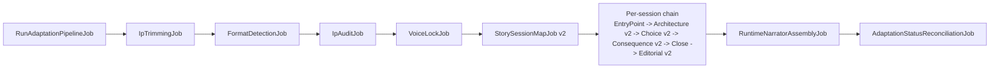

# LoreSpinner Pipeline Upgrade V2 — Full Implementation Plan (revised)

## Source-of-truth rule

The canonical prompt text for every new/updated phase comes verbatim from the `.md` deliverables in [Adaptation layer/Chaos adaptation/#4 DOCS - LORESPINNER SYSTEM PIPELINE ADDITION PROMPTS - V2 (MAY 21ST 2026)/](Adaptation layer/Chaos adaptation/#4 DOCS - LORESPINNER SYSTEM PIPELINE ADDITION PROMPTS - V2 (MAY 21ST 2026)/):

- Deliverable 1 → Voice Lock Phase prompt
- Deliverable 2 → Phase 2 (Tasks 6–9 appended to current prompt)
- Deliverable 3 → Phase 4 (replaces current prompt)
- Deliverable 4 → Phase 5 (replaces current prompt)
- Deliverable 5 → Phase 6 (replaces current prompt)
- Deliverable 6 → Phase 8 (replaces current prompt)
- Deliverable 7 → IP Trimming Agent prompt
- Deliverable 8 → Generalized Runtime Narrator Template (17 sections, 65k char ceiling)

The [#5 implementation guide folder](Adaptation layer/Chaos adaptation/#5 DOCS - V2 PIPELINE PHASE BREAKOUT AND IMPLEMENTATION GUIDE/) is used for file placement, sequencing, and runbook conventions. The runbook style is mirrored from the existing [Adaptation layer/debug/narration-fix-validation-runbook-2026-05-02.md](Adaptation layer/debug/narration-fix-validation-runbook-2026-05-02.md).

**Mechanical adaptations only.** The canonical prompts contain placeholders like `[PASTE MASTER CONTEXT BLOCK HERE]` and `[PASTE PHASE X OUTPUT]`. Those become Blade includes and `{{ }}` expressions. All instructional prose, task numbering, ban lists, output formats, and threshold language are kept verbatim. Any other deviation gets a paragraph in [chaos-mode/v2-process-log.md](chaos-mode/v2-process-log.md) with the rationale.

## Reconciliations vs. earlier discussion

The canonical prompts settle two open items differently from my original plan. We follow the docs and log the tension:

- **Choice density is hard quotas, not caps.** Deliverable 3 Task 2 says "Branching choices: must be exactly 4; Emotional choices: must be 4-6; Posture shifts: must be 6-10". We implement exactly that, and log "user preference was caps-not-quotas — defer relaxation to a future iteration" in the process log.
- **NPC dispositions are qualitative tags, not raw numeric stats.** Deliverable 2 Task 6B uses `Trust: LOW/MEDIUM/HIGH` with raises/lowers descriptors. That is between strict prose and `{trust: 0.6}`. The schema mirrors this exactly. Internal alignment scaffold counters (`chaotic_n / lawful_n / neutral_n`) remain ints — they are never narrator-visible.
- **Cold open ≠ start event ≠ first sequence.** Already split in [EntryPointDiagnosisAgent](app/Ai/Agents/Adaptation/EntryPointDiagnosisAgent.php). Deliverable 8 places cold open in Section 13 and the start-event-anchored script in Section 12. Assembler preserves this split.
- **Story-native alignment labels at runtime.** Deliverable 2 Task 9 generates per-IP labels. Internal `CHAOTIC/LAWFUL/NEUTRAL` strings stay inside pipeline JSON and the hidden runtime counter only — never injected into the assembled narrator prompt.

## Scope (unchanged)

**In:** Deliverables 1, 2, 3, 4, 5, 6, 7, 8 prompt/schema/job work, runtime template assembly, Chaos Mode runtime integration, literary state shape on `chaos_sessions`, validation runbook + runner.

**Out:** Production game runtime (`PromptController` + `NarrationAgent`). Deliverable 9 Social Echo UI (we persist its metadata fields only).

## Pipeline shape after merge

## Files to create

**Agents (canonical prompts referenced via blade):**

- [app/Ai/Agents/Adaptation/IpTrimmingAgent.php](app/Ai/Agents/Adaptation/IpTrimmingAgent.php) — schema mirrors Deliverable 7 Sections 1–5 (`story_spine`, `world_rules`, `content_triage_log`, `interactive_conversion_notes`, `trimmed_source_text`)
- [app/Ai/Agents/Adaptation/VoiceLockAgent.php](app/Ai/Agents/Adaptation/VoiceLockAgent.php) — schema mirrors Deliverable 1 Tasks 1–3 (`voice_dna_profile`, `master_rule_1_hard_bans` with `universal` + `ip_specific`, `audit_protocol_14_point`)

**Jobs:**

- [app/Jobs/Adaptation/IpTrimmingJob.php](app/Jobs/Adaptation/IpTrimmingJob.php) — modelled on [FormatDetectionJob.php](app/Jobs/Adaptation/FormatDetectionJob.php)
- [app/Jobs/Adaptation/VoiceLockJob.php](app/Jobs/Adaptation/VoiceLockJob.php) — receives the FULL original source (not the trimmed one); Deliverable 7 Final Output explicitly requires this
- [app/Jobs/Adaptation/RuntimeNarratorAssemblyJob.php](app/Jobs/Adaptation/RuntimeNarratorAssemblyJob.php) — runs after Phase 8 per session

**Blade prompts (canonical text from #4 .md files, with `[PASTE …]` placeholders mapped to Blade vars):**

- `resources/views/ai/agents/adaptation/ip-trimming/{system-prompt,prompt}.blade.php`
- `resources/views/ai/agents/adaptation/voice-lock/{system-prompt,prompt}.blade.php`
- `resources/views/ai/agents/chaos/runtime-narrator-template.blade.php` (Deliverable 8, 17 sections)

**Services:**

- [app/Ai/Adaptation/RuntimeNarratorTemplateBuilder.php](app/Ai/Adaptation/RuntimeNarratorTemplateBuilder.php) — pure assembler. Implements Deliverable 8 "ASSEMBLY JOB REFERENCE" table mapping. 65k char ceiling with the doc's compression cascade.
- [app/ChaosMode/WorldStateV2.php](app/ChaosMode/WorldStateV2.php) — typed value object (objects, relationships as natural-language updates keyed by NPC, world_flags, knowledge, player_style, emotional_ledger entries tagged by Phase 2 Task 6D category, unresolved_promises, location). Alignment scaffold lives outside this object on `chaos_sessions.alignment_scaffold`.

**Migrations:**

- `database/migrations/2026_05_24_000001_add_v2_pipeline_columns_to_story_adaptations.php` — `ip_trimming` (longText/JSON), `voice_profile` (longText/JSON)
- `database/migrations/2026_05_24_000002_add_runtime_narrator_prompt_to_session_adaptations.php` — `runtime_narrator_prompt` (longText)
- `database/migrations/2026_05_24_000003_add_v2_state_columns_to_chaos_sessions.php` — `world_state_v2` (JSON), `alignment_scaffold` (JSON), `symbolic_memory` (longText), `defining_choice_id` (string nullable), `defining_choice_line` (text nullable)

**Validation:**

- [Adaptation layer/debug/pipeline-upgrade-v2-validation-runbook.md](Adaptation layer/debug/pipeline-upgrade-v2-validation-runbook.md)
- [Adaptation layer/debug/pipeline-upgrade-v2-validation-runner.php](Adaptation layer/debug/pipeline-upgrade-v2-validation-runner.php) — numbered `stepN` mirroring [curt-fix-validation-runner.php](Adaptation layer/debug/curt-fix-validation-runner.php)

**Docs:**

- [chaos-mode/v2-process-log.md](chaos-mode/v2-process-log.md) — implementation diary + adaptation deviations + the two reconciliations above

## Files to modify

**Pipeline chain:**

- [app/Jobs/Adaptation/RunAdaptationPipelineJob.php](app/Jobs/Adaptation/RunAdaptationPipelineJob.php) — prepend `IpTrimmingJob`; insert `VoiceLockJob` after `IpAuditJob`
- [app/Jobs/Adaptation/StorySessionMapJob.php](app/Jobs/Adaptation/StorySessionMapJob.php) — append `RuntimeNarratorAssemblyJob` to per-session chain
- [app/Jobs/Adaptation/AdaptationStatusReconciliationJob.php](app/Jobs/Adaptation/AdaptationStatusReconciliationJob.php) — recognise IP_TRIMMING, VOICE_LOCK statuses; require `runtime_narrator_prompt` for COMPLETE
- [app/Enums/Adaptation/AdaptationStatusEnum.php](app/Enums/Adaptation/AdaptationStatusEnum.php) — add `IP_TRIMMING`, `VOICE_LOCK`

**Phase 2/4/5/6/8 agents (schemas expanded to match canonical OUTPUT FORMAT sections):**

- [app/Ai/Agents/Adaptation/StorySessionMapAgent.php](app/Ai/Agents/Adaptation/StorySessionMapAgent.php) — add `persistent_state_schema` (object_inventory, npc_registry with LOW/MEDIUM/HIGH disposition tags, location_registry, emotional_ledger_categories, action_history_categories), `world_reactivity_rules`, `story_guard` (Layers 1–4 with Layer 4 as template), `alignment_labels` (story-native + visual_association)
- [app/Ai/Agents/Adaptation/SessionArchitectureAgent.php](app/Ai/Agents/Adaptation/SessionArchitectureAgent.php) — five beats (setup/escalation/breath/twist/resolution), beat map with time/beat/moment/interaction, episode_content_budget, posture_shift_placements, next_session_awareness; counts enforced per Deliverable 3 quotas
- [app/Ai/Agents/Adaptation/ChoiceDesignAgent.php](app/Ai/Agents/Adaptation/ChoiceDesignAgent.php) — `branching_choices[4]`, `emotional_choices[4-6]`, `posture_shifts[6-10]`, each branching choice with `narrative_setup`, `choice_question`, `options[3]` (text + alignment + 115-125-word outcome + persistent_state_changes + world_noticed_signal), `storyguard_manifest`, `defining_lines[3]`; also `storyguard_layer_4_scene_rules` per scene
- [app/Ai/Agents/Adaptation/ConsequenceMappingAgent.php](app/Ai/Agents/Adaptation/ConsequenceMappingAgent.php) — `branching_consequence_maps[4]` with all 7 rows from Deliverable 5 Task 1, `emotional_consequence_maps`, `reactivity_trigger_specs`, `cross_episode_propagation_rules`, `freeform_consequence_guidelines`, `validation_results`
- [app/Ai/Agents/Adaptation/EditorialVerificationAgent.php](app/Ai/Agents/Adaptation/EditorialVerificationAgent.php) — 23 question records grouped into `design_audit[Q1-10]`, `voice_audit[Q11-16 + 14-point sub-grid]`, `storyguard_state_compliance[Q17-23]`, `final_verdict` (`green/amber/red` + total_passing + revision_instructions). Triggers one automatic retry into the failing phase on red.

**Phase 2/4/5/6/8 blade prompts (canonical text from #4 .md, plus existing `_master-context` include):**

- `resources/views/ai/agents/adaptation/story-session-map/system-prompt.blade.php` — append Deliverable 2 Tasks 6–9 verbatim after existing Task 5
- `resources/views/ai/agents/adaptation/session-architecture/system-prompt.blade.php` — replace with Deliverable 3 verbatim
- `resources/views/ai/agents/adaptation/choice-design/system-prompt.blade.php` — replace with Deliverable 4 verbatim (8 tasks including Task 8 defining lines)
- `resources/views/ai/agents/adaptation/consequence-mapping/system-prompt.blade.php` — replace with Deliverable 5 verbatim
- `resources/views/ai/agents/adaptation/editorial-verification/system-prompt.blade.php` — replace with Deliverable 6 verbatim
- Corresponding `prompt.blade.php` files updated to feed the new `[PASTE …]` slots from prior phase outputs (Voice Profile, Persistent State Schema, World Reactivity Rules, StoryGuard Canon, etc.) via Blade variables

**Chaos runtime:**

- [app/Http/Controllers/ChaosMode/ChaosModeController.php](app/Http/Controllers/ChaosMode/ChaosModeController.php) — `renderSystemPrompt()` now loads cached `session_adaptations.runtime_narrator_prompt`, injects runtime Sections 7 (tiered state), 8 (symbolic memory updates), 10 (arc continuity). Tiered loader: Tier 1 always, Tier 2 when current scene NPCs/locations connect to prior history, Tier 3 first turn + last turn + when `is_climactic_choice` flag fires. Legacy fallback: if `runtime_narrator_prompt` is null, render existing `partials/{story}.blade.php` (keeps the 9 existing stories alive until re-adapted). `mergeStateDelta()` rewritten for the natural-language relationship shape.
- [app/Ai/Agents/Chaos/ChaosNarrationSchema.php](app/Ai/Agents/Chaos/ChaosNarrationSchema.php) — `state_delta` shape replaced with `world_state_v2_delta`: `objects_added/removed`, `relationship_updates[]` (each `{ npc, update }` as one sentence), `world_flags_set/cleared`, `knowledge_added`, `player_style_update`, `emotional_ledger_entries[]` (tagged by Phase 2 Task 6D category), `unresolved_promises_added/resolved`, `alignment_tally_delta` (`chaotic|lawful|neutral` ints, hidden from prose), `symbolic_memory_addendum` (one natural-language sentence), `is_climactic_choice` (bool), `defining_choice_id` + `defining_choice_line` (nullable, set only when this turn resolves a branching choice)
- [app/Models/ChaosSession.php](app/Models/ChaosSession.php), [app/Models/StoryAdaptation.php](app/Models/StoryAdaptation.php), [app/Models/SessionAdaptation.php](app/Models/SessionAdaptation.php) — fillables + JSON casts for new columns

## Validation runbook structure

Following the [narration-fix-validation-runbook-2026-05-02.md](Adaptation layer/debug/narration-fix-validation-runbook-2026-05-02.md) pattern verbatim:

1. **Pre-flight** — branch checkout, `composer install`, `php artisan migrate`, env var `V2_VALIDATION_STORY_ID`
2. **Migration verification** — `php artisan migrate:status`; tinker probes that the 8 new columns exist with correct types
3. **Enum probe** — `AdaptationStatusEnum::cases()` includes `IP_TRIMMING`, `VOICE_LOCK`
4. **Prompt rendering probes** — render each new/upgraded `system-prompt.blade.php` against a fixture and grep for canonical section markers (`TASK 6 — PERSISTENT STATE SCHEMA`, `STORYGUARD LAYER 1`, `BRANCHING CHOICES (4 per session)`, `## SECTION A: DESIGN AUDIT`, `=== LORESPINNER RUNTIME NARRATOR ===`)
5. **Agent schema probes** — instantiate each agent, dump top-level schema keys, assert new keys present
6. **Pipeline run** — `php artisan stories:run-adaptation <V2_VALIDATION_STORY_ID>` on a small fixture (e.g. shorter source under `database/stories/RnD/`); poll `story_adaptations.adaptation_status` until terminal
7. **Per-deliverable output probes** — tinker queries asserting non-empty/well-shaped JSON for IP trim sections, Voice Profile (DNA + bans + 14-point), Phase 2 Tasks 6–9, Phase 4 beat map, Phase 5 4 branching/4-6 emotional/6-10 posture/defining lines, Phase 6 consequence maps, Phase 8 23/23 verdict
8. **Runtime template assembly** — load `session_adaptations.runtime_narrator_prompt`; assert ≤ 65,000 chars; assert all 17 section headers present; grep that no `CHAOTIC`/`LAWFUL`/`NEUTRAL` literal strings leak into narrator-visible sections; assert cold open (Section 13) and episode script (Section 12) come from different sources
9. **Chaos runtime smoke** — POST `/chaos-mode/start` for the test story; assert response uses assembled template (system_prompt_hash differs from legacy hash); play 3 turns; dump `chaos_sessions.world_state_v2` to confirm natural-language `relationship_updates`
10. **Tiered state loader probe** — turn 1 logs `tier_loaded=1+3`; mid-session turn logs `tier_loaded=1` (or `1+2` on connected NPC); climactic turn logs `tier_loaded=1+2+3`
11. **Voice ban regression** — runner injects known-bad strings (`"It's not X, it's Y."`, `tapestry`, em dash) into a Phase 5 fixture and runs Phase 8 standalone; expect Q11 and Q13 to flag them
12. **Backward-compat** — Chaos Mode against an unmigrated Alice; legacy partial still loads; runtime works
13. **Pass/fail summary table** — same format as narration runbook
14. **Rollback anchor** — git SHA of pre-merge HEAD + `migrate:rollback` step count + how to drop new columns

Runner script provides numbered `stepN` commands (`php "Adaptation layer/debug/pipeline-upgrade-v2-validation-runner.php" step5`) and a `runAll` for convenience.

## Implementation order on the branch (single coherent batch)

1. Migrations + enum + model fillables
2. Process log skeleton at [chaos-mode/v2-process-log.md](chaos-mode/v2-process-log.md)
3. IP Trimming agent/job/blade + chain head wiring
4. Voice Lock agent/job/blade + chain wiring
5. Phase 2 blade append + schema expansion
6. Phase 4 blade replace + schema rewrite
7. Phase 5 blade replace + schema rewrite
8. Phase 6 blade replace + schema rewrite
9. Phase 8 blade replace + schema rewrite + auto-retry hook
10. Runtime template blade + RuntimeNarratorTemplateBuilder + RuntimeNarratorAssemblyJob + chain tail wiring
11. WorldStateV2 value object + ChaosNarrationSchema rewrite + ChaosModeController rewire (tiered loader + alignment translator + legacy fallback)
12. Reconciliation job update
13. Runbook + runner script
14. Process log final pass with all deviations recorded

No partial commits — all changes land on a single `feat/pipeline-upgrade-v2` branch ready for manual validation in Laravel Cloud.

## Risk acknowledgments (logged in process log)

- IP Trimming + Voice Lock back-to-back on a 100k-token source may exceed context. Deliverable 1 supports split-and-merge in halves; the runbook documents the manual split workflow.
- 65k char ceiling may bite on screenplay-format sources. Compression cascade implemented per Deliverable 8; runbook step 8 catches overflow.
- 9 existing Chaos stories keep working via the legacy partial fallback. Migration is opt-in via re-running `stories:run-adaptation`. Cost estimate: ~$5.50–9 per IP per Deliverable 3 figures, ~$60–80 to re-adapt all 9 stories.
- Production game runtime is untouched. No regression risk there from this branch.