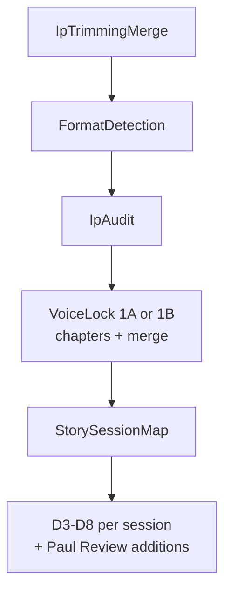

# V2.2 Chaos Adaptation Integration Plan

**Status:** Approved with pipeline-order correction (2026-06-13)

## Approval notes (incorporated)

- **Pipeline order corrected:** Voice Lock must run **after** both Format Detection and IP Audit — not before IpAudit. V2.2 Voice Lock deliverables require Format Detection output (1A vs 1B routing) **and** the Phase 1 IP Audit scorecard as prompt input.
- **Chapter/merge architecture retained:** V2.2 describes Voice Lock as a single phase; our PHP split (chapter extraction + merge synthesis) is a valid production adaptation, as long as the chapter pass gathers format-specific observations and the merge pass produces full Tasks 1–3.
- **Schema expansion is mandatory:** V2.2 is not a prompt swap alone. Rich fields must persist in `voice_profile` JSON and render in runtime Section 6 — loose prose in merge output is insufficient for enforcement, audit, and defensive display.
- **Paul Review additions:** Append-only prompt updates to existing deliverables. No new phases or jobs. Boundaries preserved (see Phase 3).

---

## What the V2.2 folder contains

| File | Role |
|------|------|
| [DELIVERABLE 1A FINAL](Adaptation%20layer/Chaos%20adaptation/V2.2/DELIVERABLE%201A%20FINAL%20-%20VOICE%20LOCK%20(NOVELIST)_NEWEST-CLEAN.md) | Novelist/prose Voice Lock — replaces original Deliverable 1 when format = novel/prose/short_story/essay |
| [DELIVERABLE 1B FINAL](Adaptation%20layer/Chaos%20adaptation/V2.2/DELIVERABLE%201B%20FINAL%20-%20VOICE%20LOCK%20(SCREENWRITER)_NEWEST-CLEAN.md) | Screenwriter Voice Lock — replaces Deliverable 1 when format = screenplay/teleplay/pilot/limited_series |
| [EXECUTION DOCUMENT](Adaptation%20layer/Chaos%20adaptation/V2.2/EXECUTION%20DOCUMENT%20%E2%80%94%20PAUL%20REVIEW%20PROMPT%20ADDITIONS%20copy.md) | Integration guide for 4 append-only prompt blocks (no new jobs/phases) |
| [REFERENCE Doyle](Adaptation%20layer/Chaos%20adaptation/V2.2/REFERENCE%20-%20VOICE%20PROFILE%20-%20ARTHUR%20CONAN%20DOYLE%20v2.1%20copy.md) | QA gold standard for 1A output shape |
| [REFERENCE Baum](Adaptation%20layer/Chaos%20adaptation/V2.2/REFERENCE%20-%20VOICE%20PROFILE%20-%20L%20FRANK%20BAUM%20v2.1%20copy.md) | QA gold standard for 1A output shape |

**Current state:** V2.1 is fully wired in PHP/Blade ([process log](Adaptation%20layer/Chaos%20adaptation/v2-implementation/process-log/v2-process-log.md)). V2.2 is docs-only. Paul Review cadence rules are not in any Blade file yet.

---

## Correct pipeline order (approved)

```
IpTrimmingMerge
  → FormatDetectionJob
    → IpAuditJob
      → [VoiceLockChapterJob × N]   (parallel batch, 1A or 1B per chapter)
        → VoiceLockMergeJob         (full synthesis, Tasks 1–3)
          → StorySessionMapJob
            → per-session batch: EntryPoint → D3 → D4 → D5 → SessionClose → D6 → D8
```



### Dependency chain

| Step | Provides | Consumed by |
|------|----------|-------------|
| FormatDetection | `detected_format` (NOVEL → 1A, SCREENPLAY → 1B) | VoiceLock chapter + merge agents |
| IpAudit | Phase 1 scorecard (`story_adaptations.ip_audit`) | VoiceLock merge prompt (already wired in [merge-prompt.blade.php](resources/views/ai/agents/adaptation/voice-lock/merge-prompt.blade.php); currently empty on fresh runs) |
| VoiceLock | Constitutional `voice_profile` (Tasks 1–3) | StorySessionMap, Choice Design, Consequence Mapping, Runtime Narrator Section 6 |
| StorySessionMap + D3–D8 | Session design + runtime template | Chaos Mode runtime |

**Blocking bug today:** [VoiceLockMergeJob.php](app/Jobs/Adaptation/VoiceLockMergeJob.php) chains `FormatDetectionJob → IpAuditJob → StorySessionMapJob` *after* voice lock (lines 108–112). [IpTrimmingMergeJob.php](app/Jobs/Adaptation/IpTrimmingMergeJob.php) dispatches VoiceLock immediately (lines 197–207). On a fresh `--force` run, Voice Lock sees `format = UNKNOWN` and `ip_audit = null`.

**Chapter/merge split (retained):** V2.2 describes a monolithic Voice Lock phase; V2.1 intentionally splits into:

- **Chapter pass** — format-specific fragment extraction (Task 1 subsets observable per chapter)
- **Merge pass** — format-specific synthesis into full profile (Tasks 1 consolidation + Tasks 2–3), with `format_detection` + `ip_audit` injected via [merge-prompt.blade.php](resources/views/ai/agents/adaptation/voice-lock/merge-prompt.blade.php)

---

## Phase 1 — Pipeline reorder (prerequisite for 1A/1B)

**Target chain:**

1. [IpTrimmingMergeJob.php](app/Jobs/Adaptation/IpTrimmingMergeJob.php) — after merge, dispatch `FormatDetectionJob` (not VoiceLock batch)
2. [FormatDetectionJob.php](app/Jobs/Adaptation/FormatDetectionJob.php) — on success, chain `IpAuditJob` (add dispatch; currently stops after save)
3. [IpAuditJob.php](app/Jobs/Adaptation/IpAuditJob.php) — on success, dispatch VoiceLock chapter batch (move logic from IpTrimmingMergeJob lines 197–207)
4. [VoiceLockMergeJob.php](app/Jobs/Adaptation/VoiceLockMergeJob.php) — chain **only** `StorySessionMapJob` (remove FormatDetection + IpAudit from lines 108–112)
5. [RunAdaptationPipelineJob.php](app/Jobs/Adaptation/RunAdaptationPipelineJob.php) — update pipeline comment diagram

**Format detection routing:** Binary `SCREENPLAY | NOVEL` ([FormatDetectionAgent.php](app/Ai/Agents/Adaptation/FormatDetectionAgent.php)) is sufficient:

- `NOVEL` → Deliverable 1A
- `SCREENPLAY` → Deliverable 1B

IpAudit already reads `format_detection` ([IpAuditJob.php](app/Jobs/Adaptation/IpAuditJob.php) line 57) — no change needed there beyond running earlier.

---

## Phase 2 — Voice Lock 1A / 1B split

### 2a. New Blade views (verbatim from V2.2 markdown, mechanical adaptations only)

Follow V2.1 convention: `@include` master context, Blade variables for placeholders (`$formatDetection`, `$ipAudit`), drop trailing footer lines.

| New view | Source doc | Used by |
|----------|-----------|---------|
| `voice-lock/chapter-system-prompt-novelist.blade.php` | 1A Task 1 subset (per-chapter observable extraction) | `VoiceLockChapterAgent` when `NOVEL` |
| `voice-lock/chapter-system-prompt-screenwriter.blade.php` | 1B Task 1 subset (action lines, dialogue per chapter) | `VoiceLockChapterAgent` when `SCREENPLAY` |
| `voice-lock/system-prompt-novelist.blade.php` | 1A full merge synthesis (Tasks 1–3, universal bans, 14-point novelist audit) | `VoiceLockMergeAgent` when `NOVEL` |
| `voice-lock/system-prompt-screenwriter.blade.php` | 1B full merge synthesis (screenplay-to-prose protocol, screenwriter audit) | `VoiceLockMergeAgent` when `SCREENPLAY` |

Wire V2.2 placeholders:

- `FORMAT DETECTION: [PASTE ...]` → `{{ json_encode($formatDetection, JSON_PRETTY_PRINT) }}`
- `PHASE 1 AUDIT: [PASTE SCORECARD]` → `{{ json_encode($ipAudit, JSON_PRETTY_PRINT) }}` (merge system prompts + merge-prompt; chapter pass may include format only)

Keep existing unified views as fallback only if format is still `UNKNOWN` (should not happen after Phase 1).

### 2b. Agent routing

- [VoiceLockChapterAgent.php](app/Ai/Agents/Adaptation/VoiceLockChapterAgent.php) — select novelist vs screenwriter chapter blade from `$adaptation->format_detection['detected_format']`
- [VoiceLockMergeAgent.php](app/Ai/Agents/Adaptation/VoiceLockMergeAgent.php) — select novelist vs screenwriter merge blade; pass real `$formatDetection` (currently hardcoded empty at line 43)
- [VoiceLockChapterJob.php](app/Jobs/Adaptation/VoiceLockChapterJob.php) — already passes format; ensure it runs after IpAudit completes
- [VoiceLockMergeJob.php](app/Jobs/Adaptation/VoiceLockMergeJob.php) — already passes `$ipAudit` and `$formatDetection` to merge-prompt; will be populated after reorder

### 2c. Schema expansion (mandatory)

Current [VoiceLockAgent.php](app/Ai/Agents/Adaptation/VoiceLockAgent.php) schema covers sections A–F only. **All V2.2 fields below must be structured JSON in `voice_profile`**, not loose prose — the runtime must enforce, audit, and render them defensively.

**Novelist (1A) — required fields:**

- `profile_type`: `"NOVELIST"`
- `narrator_perspective` (POV, reliability, distance, tense, interior monologue)
- `collocation_fingerprint` (15–20 word pairs with AI substitution notes)
- `negative_space_map` (genre-default techniques this author never uses)
- `comparative_exclusion` (2–3 authors this voice must not be confused with)
- `dialogue_tag_patterns` (said %, action beats, banned tags)
- Signature techniques: add `frequency` field
- 14-point audit: points 7 and 11 are novelist-specific (paragraph architecture, narrator compliance)

**Screenwriter (1B) — required fields:**

- `profile_type`: `"SCREENWRITER"`
- `action_line_metrics`, `screenplay_structure_metrics`, `emotional_vocabulary_hierarchy`
- `screenplay_to_prose_protocol` (element-by-element translation rules)
- 14-point audit: points 6, 7, 11 are screenwriter-specific (action compression, dialogue compression, screenplay-to-prose compliance)

Implement via two parallel schema methods on merge agent selected by `detected_format`, or shared base + `profile_type` discriminator with format-conditional required fields.

### 2d. Chapter fragment schema

Extend [VoiceLockChapterAgent.php](app/Ai/Agents/Adaptation/VoiceLockChapterAgent.php) schema with format-conditional fields so fragments carry novelist/screenwriter-specific observations into merge (e.g., action-line samples for 1B, narrator POV samples for 1A).

### 2e. Runtime template + builder

Update [RuntimeNarratorTemplateBuilder.php](app/Ai/Adaptation/RuntimeNarratorTemplateBuilder.php) and [runtime-narrator-template.blade.php](resources/views/ai/agents/chaos/runtime-narrator-template.blade.php) Section 6 to render all new structured fields. Use `@if(($voice['profile_type'] ?? '') === 'NOVELIST')` / `SCREENWRITER` conditionals with defensive defaults for stories not yet re-adapted.

---

## Phase 3 — Paul Review prompt additions (append-only)

No new jobs or phases. Draft blocks from [Execution Document](Adaptation%20layer/Chaos%20adaptation/V2.2/EXECUTION%20DOCUMENT%20%E2%80%94%20PAUL%20REVIEW%20PROMPT%20ADDITIONS%20copy.md) summaries, wired to existing Blade variables.

**Boundaries (do not cross):**

| Addition | Target | Does NOT touch |
|----------|--------|----------------|
| Runtime cadence, custom input, response length, consequence visibility enforcement | D8 / [runtime-narrator-template.blade.php](resources/views/ai/agents/chaos/runtime-narrator-template.blade.php) Section 17 | Voice Lock, Choice Design |
| Beat ending + first-3-minute rules | [session-architecture/system-prompt.blade.php](resources/views/ai/agents/adaptation/session-architecture/system-prompt.blade.php) | Runtime template |
| Choice contrast | [choice-design/system-prompt.blade.php](resources/views/ai/agents/adaptation/choice-design/system-prompt.blade.php) | Runtime template |
| Consequence visibility design | [consequence-mapping/system-prompt.blade.php](resources/views/ai/agents/adaptation/consequence-mapping/system-prompt.blade.php) | Runtime template |

Voice Lock extraction, ban lists, and 14-point audit remain separate and are **not** replaced.

**Bug fixes to embed:**

| Bug | Fix |
|-----|-----|
| Word count | **300–350** soft ceiling, **400** hard, **500** climax (NOT 100–130) |
| Custom input | **Deliverable 8 only** — not Choice Design |
| Consequence latency | Target **2 responses**, hard max **3** |

### Addition 1 → runtime-narrator-template Section 17

7 consolidated rules: Response Length, Forward Pull Endings, Beat Response Structure, No Dead-End Responses, Consequence Visibility (reference `$consequenceMap`, `$freeformGuidelines` from Section 15), Description Economy, Custom Input Protocol (Absorb → Reinterpret → Respond → Redirect; uses `$protagonist`, StoryGuard canon).

### Addition 2 → session-architecture

Beat Ending Rules + First-3-Minutes Rule (first choice ≤90s, first visible consequence ≤120s; complements existing 300-word choice #1 rule).

### Addition 3 → choice-design

Choice Contrast Rules — different player instincts per option; contrast test; visibly different outcomes within 2 responses. Reference `options[].text`, `downstream_effect`, `world_noticed_signal`, `what_this_choice_tracks`.

### Addition 4 → consequence-mapping

Consequence Visibility Rule — WHAT changes, WHEN (target 2, max 3), HOW player sees it. Add structured `visibility_timing` to path schema in [ConsequenceMappingAgent.php](app/Ai/Agents/Adaptation/ConsequenceMappingAgent.php) for validation.

---

## Phase 4 — Validation and re-adaptation

1. Update [pipeline-upgrade-v2-validation-runner.php](Adaptation%20layer/Chaos%20adaptation/v2-implementation/validation/pipeline-upgrade-v2-validation-runner.php) — render new voice-lock blades; verify pipeline job chain order
2. Re-adapt QA baselines:
   - **Alice (Baum/novelist)** — compare against [REFERENCE Baum](Adaptation%20layer/Chaos%20adaptation/V2.2/REFERENCE%20-%20VOICE%20PROFILE%20-%20L%20FRANK%20BAUM%20v2.1%20copy.md): collocation ≥15, negative space ≥5, comparative exclusion ≥2
   - **Sherlock (Doyle/novelist)** — compare against [REFERENCE Doyle](Adaptation%20layer/Chaos%20adaptation/V2.2/REFERENCE%20-%20VOICE%20PROFILE%20-%20ARTHUR%20CONAN%20DOYLE%20v2.1%20copy.md)
3. Inspect assembled runtime prompt for Section 6 expanded fields + Section 17 cadence rules
4. Force re-adapt remaining Chaos stories: `php artisan stories:run-adaptation <slug> --force`
5. Smoke-test Chaos Mode: response length (300–350), forward-pull endings, custom input handling, visible consequences within 2 turns

---

## What we are NOT changing

- Chapter/merge Voice Lock architecture (production adaptation of V2.2 monolithic phase)
- Ban lists, 14-point audit structure, StoryGuard, Deliverable 2 format gate, Deliverables 6/7/9 — untouched except Paul append targets
- No new pipeline phases or jobs
- No legacy V1 fallback paths

---

## Risk notes

| Risk | Mitigation |
|------|-----------|
| Merge timeout with richer 1A/1B synthesis | Keep chapter/merge split; monitor merge timeout (420s); increase if needed |
| Existing `voice_profile` JSON shape | Defensive Section 6 defaults; re-adapt required for full V2.2 enforcement |
| Paul Review 300–350 words vs choice outcome lengths (115–125) | Applies to **runtime narrator turns**, not pipeline-authored choice outcomes |
| First-3-minutes vs 300-word rules | Both apply; 300 words ≈ 90s at reading pace |

---

## Approved implementation order

1. Reorder pipeline: **FormatDetection → IpAudit → VoiceLock → StorySessionMap**
2. Add Voice Lock 1A/1B Blade prompts and agent routing
3. Expand Voice Profile schema (mandatory novelist + screenwriter fields)
4. Update runtime template Section 6 to render expanded Voice Profile defensively
5. Append Paul Review rules to correct existing prompts (D8 → D3 → D4 → D5)
6. Update validation runner
7. Re-adapt Alice and Sherlock as QA baselines
8. Smoke-test Chaos Mode runtime

Estimated touch count: ~15–20 files (4 new blades, 6 modified jobs/agents, 4 modified system prompts, 1 runtime template, 1 builder, validation runner).
