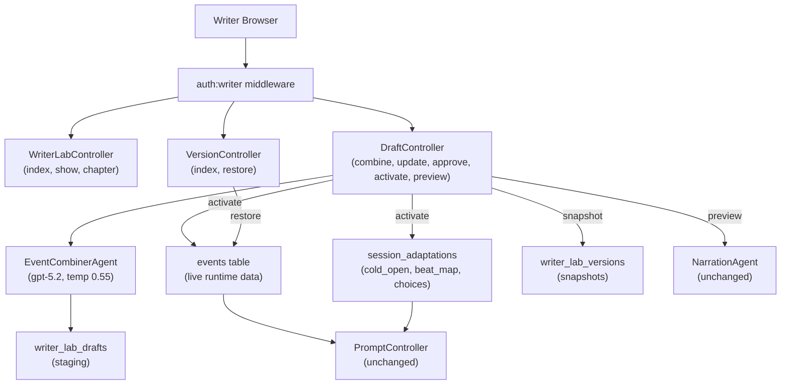

# Writer Lab — Final Execution Plan

## Architecture Overview




---

## 1. Auth — New `writer` Guard

The `managers` guard is already taken by Filament. Writer Lab gets its own guard and model.

### 1.1 Migration — `writers` table

New file: `database/migrations/YYYY_MM_DD_000001_create_writers_table.php`

Columns: `id`, `name`, `email` (unique), `password`, `remember_token`, `timestamps`.

### 1.2 Model — `[app/Models/Writer.php](app/Models/Writer.php)`

Extends `Authenticatable`. Casts password as hashed. Mirrors `User` model shape.

### 1.3 Update `[config/auth.php](config/auth.php)`

Add to `guards`:

```php
'writer' => ['driver' => 'session', 'provider' => 'writers'],
```

Add to `providers`:

```php
'writers' => ['driver' => 'eloquent', 'model' => App\Models\Writer::class],
```

### 1.4 Routes — `routes/routes/writer.php` (new file)

```
prefix: writer/
name prefix: writer.

guest middleware group:
  GET  authentication/register   → Writer\Authentication\RegisterController@create   writer.authentication.register.create
  POST authentication/register   → Writer\Authentication\RegisterController@store    writer.authentication.register.store
  GET  authentication/login      → Writer\Authentication\LoginController@create      writer.authentication.login.create
  POST authentication/login      → Writer\Authentication\LoginController@store       writer.authentication.login.store

auth:writer middleware group:
  DELETE authentication/logout   → Writer\Authentication\LogoutController@destroy    writer.authentication.logout
  (all Writer Lab routes — see Section 3)
```

Require in `[routes/web.php](routes/web.php)`:

```php
require __DIR__.'/routes/writer.php';
```

### 1.5 Auth Controllers — `app/Http/Controllers/Writer/Authentication/`

Three files: `RegisterController.php`, `LoginController.php`, `LogoutController.php`.

`RegisterController` reuses the existing `CreateAuthenticatableGuardAction`:

```php
$writer = $createAuthenticatableGuard->handle('writer', $email, $password);
auth('writer')->login($writer, remember: true);
return to_route('writer.writer-lab.index');
```

`LoginController` calls `auth('writer')->attempt([...])` then redirects to `writer.writer-lab.index`.
`LogoutController` calls `auth('writer')->logout()` and redirects to login.

### 1.6 Vue Pages — `resources/js/pages/WriterLab/Authentication/`

- `Register.vue` — mirrors `resources/js/pages/User/Authentication/Register.vue` layout and style. Fields: name, email, password, password_confirmation.
- `Login.vue` — mirrors `User/Authentication/Login.vue`. Fields: email, password.

Both use the existing Tailwind/primary color system (`primary-500` = Tiffany Blue).

---

## 2. Database Migrations

### 2.0 `requires_choice` on `events`

New file: `database/migrations/YYYY_MM_DD_000001_add_requires_choice_to_events_table.php`

```php
$table->boolean('requires_choice')->default(true)->after('session_number');
```

Default `true` preserves all existing runtime behavior. When `false`, the system prompt gains a `=== FLOW MOMENT ===` block that instructs the narrator to return `advance_event: true` and flow past the event without player pause. Migration runs automatically on every Laravel Cloud redeploy.

### 2.1 `writer_lab_drafts`

New file: `database/migrations/YYYY_MM_DD_000002_create_writer_lab_drafts_table.php`

```
id
story_id            FK → stories, cascadeOnDelete
chapter_id          FK → chapters, cascadeOnDelete
session_number      unsignedInteger nullable
source_event_ids    json                   -- array of event IDs being combined
rewritten_content   longText
derived_objectives  text nullable
derived_attributes  json nullable
beat_type           string nullable
requires_choice     boolean default true
canonical_anchors   json nullable
previous_state      json                   -- snapshot of original event rows for rollback
adaptation_patch    json nullable          -- changes to session_adaptations on activate
type                string default 'combine' -- combine|split|reorder|edit
split_parts         json nullable          -- [{content, objectives, beat_type, requires_choice}, ...] for split drafts
event_order         json nullable          -- [{event_id, new_position}, ...] for reorder drafts
status              string default 'draft' -- draft|ai_written|writer_approved|activated
activated_at        timestamp nullable
timestamps
```

### 2.2 `writer_lab_versions`

New file: `database/migrations/YYYY_MM_DD_000003_create_writer_lab_versions_table.php`

```
id
story_id             FK → stories, cascadeOnDelete
session_number       unsignedInteger
version_number       unsignedInteger
snapshot_events      json     -- full event rows before activate
snapshot_adaptation  json     -- full session_adaptation before activate
is_active            boolean default false
note                 string nullable
created_at           (no updated_at — snapshots are immutable)
```

### 2.3 `is_preview` on `games`

New file: `database/migrations/YYYY_MM_DD_000004_add_is_preview_to_games_table.php`

```php
$table->boolean('is_preview')->default(false)->after('story_id');
```

---

## 3. Writer Lab Routes & Controllers

All routes live inside the `auth:writer` group in `routes/routes/writer.php`.

```
GET  writer/writer-lab                                           writer.writer-lab.index
GET  writer/writer-lab/{story}                                   writer.writer-lab.show
GET  writer/writer-lab/{story}/chapters/{chapter}                writer.writer-lab.chapter

POST  writer/writer-lab/{story}/chapters/{chapter}/drafts/combine                  drafts.combine
POST  writer/writer-lab/{story}/chapters/{chapter}/drafts/split                    drafts.split
POST  writer/writer-lab/{story}/chapters/{chapter}/drafts/reorder                  drafts.reorder
GET   writer/writer-lab/{story}/chapters/{chapter}/drafts/{draft}                  drafts.show
PATCH writer/writer-lab/{story}/chapters/{chapter}/drafts/{draft}                  drafts.update
POST  writer/writer-lab/{story}/chapters/{chapter}/drafts/{draft}/approve          drafts.approve
POST  writer/writer-lab/{story}/chapters/{chapter}/drafts/{draft}/activate         drafts.activate
POST  writer/writer-lab/{story}/chapters/{chapter}/drafts/{draft}/preview          drafts.preview

GET  writer/writer-lab/{story}/versions                          versions.index
POST writer/writer-lab/{story}/versions/{version}/restore        versions.restore
```

### 3.1 `WriterLabController` — `app/Http/Controllers/Writer/WriterLab/WriterLabController.php`

- `index()` → list stories with `adaptation_status`, chapter count, session count. Returns Inertia `WriterLab/Index`.
- `show(Story $story)` → list chapters with event counts and session numbers. Returns Inertia `WriterLab/Show`.
- `chapter(Story $story, Chapter $chapter)` → load events ordered by position + matching `SessionAdaptation` records keyed by session_number. Also load any active drafts for this chapter. Returns Inertia `WriterLab/Chapter`.

`chapter()` data shape passed to Vue:

```php
[
    'story'              => $story,
    'chapter'            => $chapter,
    'prevChapter'        => ...,
    'nextChapter'        => ...,
    'events'             => $events,          // id, position, title, objectives, attributes, session_number, content
    'sessionAdaptations' => $adaptations,     // keyed by session_number, contains cold_open, beat_map, choices
    'activeDrafts'       => $activeDrafts,    // drafts for this chapter with status != activated
]
```

### 3.2 `DraftController` — `app/Http/Controllers/Writer/WriterLab/DraftController.php`

`**split()**` — POST with `{ event_id: int }`:

1. Validate event belongs to chapter
2. Load event, snapshot `previous_state`
3. Create draft `type='split'`, `source_event_ids=[event_id]`, `split_parts=[{content: full, objectives: ..., requires_choice: true}, {content: '', objectives: ''}]`
4. Status `draft` — writer fills part 2 manually in the UI
5. Redirect to `drafts.show`

`**reorder()**` — POST with `{ event_order: [{event_id, new_position}] }`:

1. Validate all event_ids belong to chapter
2. Create draft `type='reorder'`, `event_order=...`
3. Status `writer_approved` immediately (no AI, no review needed)
4. Redirect to `drafts.show`

`**combine()**` — POST with `{ event_ids: [int] }`:

1. Validate all event IDs belong to `$chapter->id` → 422 if any cross-chapter
2. Load events, build `canonical_anchors` from merged `objectives` + flattened `attributes` values
3. Load `SessionAdaptation` for the events' `session_number` — pass `cold_open`, `beat_map`, and `session_choice_design` to combiner prompt so it is aware of the established structure
4. Snapshot `previous_state` from event rows
5. Call `EventCombinerAgent::prompt($renderedPrompt)->toArray()`
6. Store `WriterLabDraft` with status `ai_written`
7. Return Inertia redirect to `drafts.show`

`**update()**` — PATCH with `{ rewritten_content, adaptation_patch? }`:
Sets status back to `draft`, stores writer's manual edits and any adaptation changes (cold_open text, choice option text, etc.).

`**approve()**` — POST:
Sets status to `writer_approved`.

`**activate()**` — POST (only if status = `writer_approved`):
Wrapped in `DB::transaction()`. Dispatches on `$draft->type`:

**combine:** Survivor event (lowest position) → update content/objectives/attributes. Delete absorbed event rows.

**split:** Update original event with `split_parts[0]`. For each additional part, UPDATE all subsequent event positions += (count-1) to make room, then INSERT new event rows.

**reorder:** Bulk `UPDATE events SET position = new_position WHERE id = event_id` for each entry in `event_order`. Since `position` has no unique constraint, this is safe in a single transaction.

**edit:** Update single event with `rewritten_content`.

All types: Snapshot → `WriterLabVersion::create()`. Apply `adaptation_patch` if set. Mark draft activated.

`**restore()` in VersionController** — POST:
Reads `snapshot_events`, re-upserts each event row by id. Re-applies `snapshot_adaptation` to `session_adaptations`.

`**preview()`** — POST (returns JSON, not Inertia):

Mirrors `GameController::generateFirstNarration()` exactly — no private method issue. Both directly call `view('ai.agents.narration.system-prompt', [...])` and `NarrationAgent::make(customInstructions: $systemPrompt)->prompt(...)`. The preview controller does the same: load story system_prompt, load SessionAdaptation, render the same Blade view with `$draft->rewritten_content` as `currentEvent.content`, call NarrationAgent, return `{ response, choices }` JSON. No game record created. No existing code changed.

---

## 4. EventCombinerAgent

### 4.1 Agent class — `app/Ai/Agents/WriterLab/EventCombinerAgent.php`

```php
#[Model('gpt-5.2')]
#[Temperature(0.55)]    // lower than narrator — editorial precision
#[Timeout(90)]
class EventCombinerAgent implements Agent, HasStructuredOutput
{
    use Promptable;

    public function instructions(): string
    {
        return view('ai.agents.writer-lab.event-combiner.system-prompt')->render();
    }

    public function schema(JsonSchema $schema): array
    {
        return [
            'rewritten_content'   => $schema->string()->required()...,
            'derived_objectives'  => $schema->string()->required()...,
            'derived_attributes'  => $schema->array()->required()->items($schema->string()->required()),
            'beat_type'           => $schema->string()->required()...,
            'requires_choice'     => $schema->boolean()->required()...,
            'canonical_anchors'   => $schema->array()->required()->items($schema->string()->required()),
        ];
    }
}
```

### 4.2 System prompt — `resources/views/ai/agents/writer-lab/event-combiner/system-prompt.blade.php`

Key sections:

- Role: "You are a narrative editor for interactive fiction, not a narrator. Your job is compression and preservation — not performance."
- IP compliance reminder: follow `style_profile` voice exactly, no new inventions
- Canonical anchor hard rule: every anchor must appear explicitly in the output or the rewrite fails
- Beat type rule: if any source event contains a branching choice beat (`requires_choice = true` in `session_choice_design`), the combined event inherits `requires_choice = true`
- Consistency rule: the rewrite's tone must be continuous with the established `cold_open` prose — do not shift register or POV
- Anti-pattern: do not narrate, do not address the player — write third-person body text that the narrator will later render

### 4.3 User prompt — `resources/views/ai/agents/writer-lab/event-combiner/prompt.blade.php`

Variables passed: `$styleProfile`, `$sourceEvents` (array with content/objectives/attributes), `$canonicalAnchors`, `$coldOpen` (existing cold_open for tone reference), `$beatMap` (session beat map), `$choiceDesign` (session_choice_design to check if any source event is a choice beat).

---

## 5. Models

### `app/Models/WriterLabDraft.php`

- `casts`: `source_event_ids → array`, `derived_attributes → array`, `canonical_anchors → array`, `previous_state → array`, `adaptation_patch → array`
- `belongsTo`: `Story`, `Chapter`
- Scope: `active()` → `whereNotIn('status', ['activated'])`

### `app/Models/WriterLabVersion.php`

- `casts`: `snapshot_events → array`, `snapshot_adaptation → array`
- `belongsTo`: `Story`
- No `updated_at` (snapshots are immutable)

### Update `[app/Models/Game.php](app/Models/Game.php)`

Add `'is_preview' => 'boolean'` to `casts()`. Add docblock `@property bool $is_preview`.

---

## 6. Vue Pages (`resources/js/pages/WriterLab/`)

All use existing Tailwind theme (primary-500 Tiffany Blue, `--color-background: #1a1a1a`).

- `Authentication/Register.vue` — name + email + password form, links to login
- `Authentication/Login.vue` — email + password form, links to register
- `Index.vue` — story grid with adaptation status badge and chapter count
- `Show.vue` — chapter list with event/session counts, "Open in Writer Lab" button per chapter
- `Chapter.vue` — two-panel layout:
  - Left: event cards (position, session_number badge, title, objectives, first 200 chars). Checkbox selection for combine. Chapter nav at top.
  - Right: session tab bar → for active tab: cold_open block, beat_map list, choices (A/B/C text), active drafts list
  - Bottom action bar: "Combine Selected Events" button (enabled when ≥2 events selected)
- `Draft.vue` — side-by-side:
  - Left: read-only source event list + canonical anchor list
  - Right: editable textarea (rewritten_content) + approve/preview buttons
  - Canonical anchor checklist: each anchor highlighted green/red based on substring presence in textarea
  - Preview panel: shows narrator `response` HTML + choices after preview call
- `Versions.vue` — version history table with snapshot date, session number, version number, note, restore button

---

## 7. File Summary


| File                                                                          | New / Modified                         |
| ----------------------------------------------------------------------------- | -------------------------------------- |
| `database/migrations/..._create_writers_table.php`                            | New                                    |
| `database/migrations/..._create_writer_lab_drafts_table.php`                  | New                                    |
| `database/migrations/..._create_writer_lab_versions_table.php`                | New                                    |
| `database/migrations/..._add_is_preview_to_games_table.php`                   | New                                    |
| `app/Models/Writer.php`                                                       | New                                    |
| `app/Models/WriterLabDraft.php`                                               | New                                    |
| `app/Models/WriterLabVersion.php`                                             | New                                    |
| `app/Models/Game.php`                                                         | Modified (add `is_preview` cast)       |
| `config/auth.php`                                                             | Modified (add writer guard + provider) |
| `routes/web.php`                                                              | Modified (require writer.php)          |
| `routes/routes/writer.php`                                                    | New                                    |
| `app/Http/Controllers/Writer/Authentication/RegisterController.php`           | New                                    |
| `app/Http/Controllers/Writer/Authentication/LoginController.php`              | New                                    |
| `app/Http/Controllers/Writer/Authentication/LogoutController.php`             | New                                    |
| `app/Http/Controllers/Writer/WriterLab/WriterLabController.php`               | New                                    |
| `app/Http/Controllers/Writer/WriterLab/DraftController.php`                   | New                                    |
| `app/Http/Controllers/Writer/WriterLab/VersionController.php`                 | New                                    |
| `app/Ai/Agents/WriterLab/EventCombinerAgent.php`                              | New                                    |
| `resources/views/ai/agents/writer-lab/event-combiner/system-prompt.blade.php` | New                                    |
| `resources/views/ai/agents/writer-lab/event-combiner/prompt.blade.php`        | New                                    |
| `resources/js/pages/WriterLab/Authentication/Register.vue`                    | New                                    |
| `resources/js/pages/WriterLab/Authentication/Login.vue`                       | New                                    |
| `resources/js/pages/WriterLab/Index.vue`                                      | New                                    |
| `resources/js/pages/WriterLab/Show.vue`                                       | New                                    |
| `resources/js/pages/WriterLab/Chapter.vue`                                    | New                                    |
| `resources/js/pages/WriterLab/Draft.vue`                                      | New                                    |
| `resources/js/pages/WriterLab/Versions.vue`                                   | New                                    |


**Nothing in the runtime is touched:** `PromptController`, `NarrationAgent`, `system-prompt.blade.php`, `GameController`, `Game::world_state`, all adaptation pipeline jobs — unchanged.