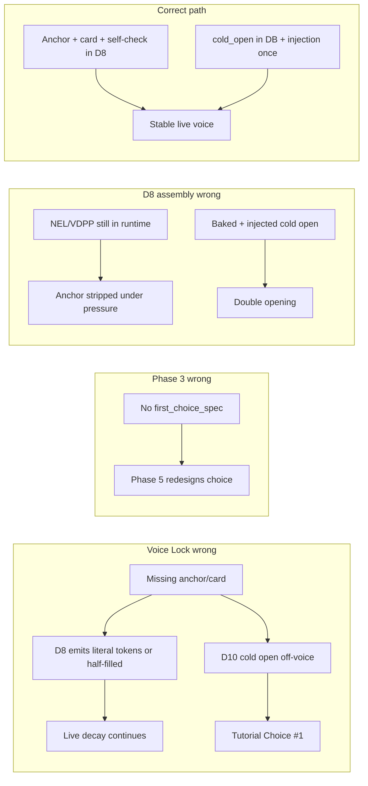

# V2.3 Implementation Checklist — File-by-File

This maps **current code → V2.3 target → downstream consequences**, in install order. Use it as the build/runbook for Cursor and pipeline engineering.

**Plan status:** execution-ready after the guardrails below. Do not execute blindly — confirm each sprint checkpoint before the next.

### Pre-execution guardrails (locked)

1. **NEL path** — `numerical_enforcement_layer` stays at `author_voice_dna_profile.numerical_enforcement_layer` (1B v2 canonical). **No** new top-level `voice_profile.numerical_enforcement_layer`. V2.3 numeric diagnostics → `build_time_qa_protocol`.
2. **Chapter fragments** — **Mandatory** anchor candidate fields on every chapter pass; merge synthesizes final anchor/card/self-check (§1.2).
3. **D8 template** — D8 v2 **source** + **one substitution**: Section 13 = `[OPENING_SCENE_INJECTION_POINT]`, not doc `{{PHASE_3_COLD_OPEN_PROSE}}` baked at assembly (§4.1).
4. **Slices** — Phase 2 = `alignmentContext()` only. Phase 3 = `dnaBansAndAnchor()`. Phases 6–7 = `dnaAndBans()` only. Phase 5 = compact **`dnaBansAndAnchorCard()`** when build-time player-facing copy (§ ChoiceDesign voice guard) — **never** full Voice Anchor in Phase 5.
5. **Re-adaptation** — `stories:run-adaptation {slug} --force` = **full** pipeline from IP trim. Not “Voice Lock merge onward.” Partial reruns need an explicit verified resume path (§ Re-adaptation matrix).
6. **Two prompt concerns** — Runtime D8 cold open ≠ Phase 3 build prompt. D8 keeps injection placeholder; Phase 3 prompt is **upgraded to D10** in place (§ Phase 3 / D10).
7. **Prompt source of truth** — All agent/system prompt text comes **verbatim** from the V2.3 deliverable `.md` files in this folder (§ Prompt source of truth). **No summaries.** Preserve existing Blade `$variables`, `@include`s, and Job pass-throughs so rendered prompts contain real data, not doc placeholders.
8. **D10 / EntryPointDiagnosis schema — preserve runtime keys** — Extend schema **additively**. Do **not** rename or remove keys already consumed by runtime, Writer Lab, or downstream jobs (§ D10 schema guard).
9. **ChoiceDesign voice slice — decide before Sprint C** — Inspect whether Phase 5 emits build-time player-facing prose. **Current code: yes** → use compact voice constraint (`anchor_card`, `first_choice_spec.voice_guidance`), **not** full Voice Anchor (§ ChoiceDesign voice guard).

---

## Two prompt concerns (do not conflate)

These are **separate** deliverables and **separate** code paths. Cursor must not treat “cold open” as one thing.

### 1. Runtime D8 prompt (cached `runtime_narrator_prompt`)

| Rule | Detail |
|------|--------|
| Do **not** bake `cold_open` prose into the cached runtime prompt | Assembly must not copy Phase 3 prose into Section 13 body text |
| Keep **`[OPENING_SCENE_INJECTION_POINT]`** | Existing placeholder in `runtime-narrator-template.blade.php` |
| Live injection owner | **`ChaosEngineService`** injects `entry_point_diagnosis.cold_open` **once** at session start (`isSessionStart=true`) |
| Doc vs code | D8 v2 doc shows `{{PHASE_3_COLD_OPEN_PROSE}}` at assembly — **substitute** with placeholder (§4.1) |

### 2. Phase 3 build prompt (`EntryPointDiagnosisJob`)

| Rule | Detail |
|------|--------|
| **Current prompt ≠ Deliverable 10** | Today’s `entry-point-diagnosis/system-prompt.blade.php` is **Entry Point Diagnosis** (60s stakes test, cut, short cold open). It is **not** assumed equivalent to D10. |
| **D10 = new Phase 3 design standard** | Cold Open & First Agency Design: earned intro, Voice Anchor–driven prose, stakes-tied **first_choice_spec**, verification gate — not “find cut point” alone. |
| **No duplicate job** | `EntryPointDiagnosisJob` **is** the Phase 3 owner in `StorySessionMapJob`. **Replace/upgrade** prompt + `EntryPointDiagnosisAgent` schema + `entry_point_diagnosis` output. Do **not** add a second Phase 3 job unless code inspection proves no existing owner (it exists). |
| **After upgrade, Phase 3 must output** | See output contract below |
| **Phase 5** | Must consume **`first_choice_spec`** (D4 patch) |
| **Runtime** | Receives `cold_open` via **injection only**, not as baked D8 template prose |

**Phase 3 output contract (post-D10 upgrade)** — persisted on `session_adaptations.entry_point_diagnosis`:

| Field | Purpose | Consumer |
|-------|---------|----------|
| `cold_open` / `cold_open_prose` | In-voice opening prose (~120–180 words to first choice) | **`ChaosEngineService`** (runtime injection); not D8 assembly |
| `cut_point` | Where cold open ends / session content begins | Phase 4 SETUP beat |
| `entry_point` (or equivalent) | Strongest source moment chosen | Phase 4, editorial Q1 |
| `emotional_promise` | One-line engagement hook | Phase 5, runtime injection block |
| `first_choice_spec` | Threshold, stakes tie, three option directions, unexpected third path | **Phase 5 Task 1** (D4 patch) — expand, do not redesign |
| Protagonist / world / stakes setup | Earned identity, situation, minimal world — not résumé dump | Phase 4, cold open quality |
| `start_event_position` (+ ids) | Event ordinal for session trim | `RuntimeNarratorTemplateBuilder`, event filter |

---

## D10 schema guard — preserve runtime-consumed keys

When extending `EntryPointDiagnosisAgent` for D10, treat the persisted `entry_point_diagnosis` JSON as a **backward-compatible contract**. New D10 fields are **additive**; existing keys must remain readable by current consumers without migration.

### Do not rename or remove (locked)

| Key | Why |
|-----|-----|
| `cold_open` | **`ChaosEngineService`** injects at session start; Writer Lab, DraftController, export |
| `emotional_promise` | **`ChaosEngineService`**, `RuntimeNarratorTemplateBuilder`, **`ChoiceDesignJob`**, editorial Q2 |
| `start_event_position` | Agent output + **`RuntimeNarratorTemplateBuilder`** event filter; Job may normalize to resolved ordinal |
| `start_event_id` | **Not agent schema** — **`EntryPointDiagnosisJob`** enriches after agent response from `start_event_position`; used by DraftController, PlaygroundController, Writer Lab, SimulateGameStart |
| `start_event_chapter_position`, `start_event_local_position` | Job-enriched; keep enrichment logic in **`EntryPointDiagnosisJob.php`** |
| `format_specific_cut` (object) | Writer Lab UI; **`ChaosEngineService`** reads nested `must_reintroduce`; narration system prompt |
| `format_specific_cut.must_reintroduce` | **`ChaosEngineService`**, `resources/views/ai/agents/narration/system-prompt.blade.php` |
| `format_specific_cut.cut_point`, `original_before_cut`, `cut_eliminates` | Writer Lab entry-point panel; editorial / Phase 4 context |
| `editorial_diagnosis` | Writer Lab, **`EditorialVerificationJob`** input, export |

If D10 prose uses different names internally, **map to these persisted keys** on save — do not drop legacy keys in favor of new-only names.

### Additive D10 fields (extend schema + prompt output)

| Field | Purpose | Primary consumer |
|-------|---------|------------------|
| `first_choice_spec` | Stakes-tied first agency moment (threshold, directions, unexpected third path, optional `voice_guidance`) | **Phase 5 / D4 Task 1** |
| `cut_point` | Top-level cut summary if D10 emits separately | Phase 4 — **also populate** `format_specific_cut.cut_point` when applicable so Writer Lab stays intact |
| `entry_point` | Strongest source moment chosen | Phase 4, editorial Q1 |
| Protagonist / world / stakes setup blocks | Earned intro metadata (per D10 FINAL OUTPUT) | Phase 4, editorial |
| D10 verification fields | Build-time YES/NO gate | Editorial / QA — optional in export |

**Job rule:** Keep **`EntryPointDiagnosisJob`** post-processing that resolves `start_event_position` → `start_event_id` (+ chapter/local positions). D10 must still return a valid `start_event_position` from the session event list.

**Schema rule:** `EntryPointDiagnosisAgent::schema()` = **union** of preserved keys above + new D10 keys. Never `withoutAdditionalProperties()` at root if that would strip Job-enriched fields on re-validation.

---

## ChoiceDesign voice guard — inspect before Sprint C

Guardrail 4 assigns Phases 6–7 to `dnaAndBans()` with **no** Voice Anchor. Phase 5 may need a **narrow exception** depending on whether Choice Design writes player-facing copy at build time or only structural logic for the runtime narrator to expand later.

### Pre-Sprint C inspection (mandatory)

Before wiring D4 / `ChoiceDesignJob`, confirm output shape against **current code**:

| Check | Where to look | Current finding (as of plan write) |
|-------|---------------|-------------------------------------|
| Player-facing option labels? | `ChoiceDesignAgent` → `options[].text` | **Yes** — one declarative sentence per option |
| Player-facing outcome prose? | `options[].outcome` (115–125 words), emotional choice outcomes (80–100 words) | **Yes** |
| Questions / setup copy? | `choice_question`, `narrative_setup`, `narrative_lead_in`, `defining_line` | **Yes** |
| Runtime reads build-time copy? | `RuntimeNarratorTemplateBuilder` embeds `session_choice_design` into cached `runtime_narrator_prompt` | **Yes** — not structural-only |

**Conclusion for Sprint C (current architecture):** ChoiceDesign **does** produce final player-facing labels and prose at adaptation time. **Do not** pass full **`dnaBansAndAnchor()`** (Voice Anchor exemplars) into Phase 5 — token bloat + double-anchoring with D8 runtime.

### Voice input rule (when player-facing copy confirmed)

| Pass | Do not pass | Pass instead |
|------|-------------|--------------|
| Full Voice Anchor (`voice_anchor` exemplars) | ❌ | — |
| `dnaBansAndAnchor()` | ❌ | — |
| Compact constraint | — | **`anchor_card`** from merged `voice_profile` |
| Phase 3 voice hint | — | **`first_choice_spec.voice_guidance`** (or equivalent D10 subfield) when present |
| Hard limits | — | **`master_rule_1_hard_bans`** (via slim slice — see below) |

**Recommended slice for ChoiceDesign (player-facing path):** add **`VoiceProfilePromptSlice::dnaBansAndAnchorCard()`** — `master_rule_1_hard_bans` + `anchor_card` only (no `voice_anchor`, no full Section 1 DNA). Wire in **`ChoiceDesignJob`** + `choice-design/prompt.blade.php`. This is **not** the same as `dnaBansAndAnchor()` used by Phase 3.

**Alternative path (only if inspection disproves player-facing copy):** If ChoiceDesign is refactored to structural-only (IDs, alignment, consequence maps; runtime narrator writes all option/outcome prose live) → keep **`dnaAndBans()`** as planned and document the refactor in Sprint C notes.

### Sprint C gate

- [ ] **C0 (before C3):** Re-run inspection table above; record YES/NO on player-facing copy
- [ ] If YES → implement `dnaBansAndAnchorCard()` (or equivalent minimal wiring); **do not** wire `dnaBansAndAnchor()` into `ChoiceDesignJob`
- [ ] If NO → keep `dnaAndBans()`; note architectural change in plan

---

## Prompt source of truth (verbatim from deliverable `.md` files)

**All V2.3 prompt text must be copied from the authoritative deliverable markdown files in:**

`Adaptation layer/Chaos adaptation/V2.3 - JUNE 18, 2026/`

**Do not summarize, paraphrase, or re-write prompt intent in Blade.** This plan describes *where* prompts go and *what* to wire — the **wording** lives in the deliverable files. Cursor must open each file and paste the prompt body **true to the source**.

**Also:** verbatim prose must **not** break the pipeline. Deliverable text is static instructions; **runtime data** still flows through existing Blade `$variables`, `@include`s, and `@foreach`s that jobs already pass. **Read the target Blade + calling Job before editing** — preserve wiring; only swap instruction body text.

### Two-layer Blade pattern (do not break)

Most adaptation agents split prompt assembly into two files. **Only replace the instruction layer** unless the deliverable explicitly changes input headers.

| Layer | Typical file | What to paste from deliverable | What to **keep** from codebase |
|-------|----------------|----------------------------------|--------------------------------|
| **System / instructions** | `*-system-prompt.blade.php`, `system-prompt-*.blade.php` | COPY-PASTE body (tasks, rules, gates) | Leading `@include('_master-context')`, `$ipAudit` / `$formatDetection` JSON blocks the merge agent already receives |
| **User / runtime payload** | `*-prompt.blade.php` (e.g. `entry-point-diagnosis/prompt.blade.php`) | D10/D4 **input header lines** where deliverable adds new inputs | Existing `@include('_voice-profile-context')`, `$sessionEvents` loop, `$sessionSourcePages`, `$beatMap`, etc. — **do not delete** unless deliverable supersedes that input |

**Voice Lock is three files, not one:**

| File | Role | V2.3 action |
|------|------|-------------|
| `voice-lock/system-prompt-{novelist\|screenwriter}.blade.php` | Merge agent **instructions** | Paste 1A/1B COPY-PASTE body; keep `_master-context` + audit/format JSON at top |
| `voice-lock/merge-prompt.blade.php` | Merge **user message** (chapter fragments) | Keep `$voiceFragments` `@foreach`; update synthesis bullets for anchor candidates if deliverable requires |
| `voice-lock/chapter-system-prompt-{…}.blade.php` | Chapter agent **instructions** | Fragment tasks from same deliverable + §1.2 candidate fields |
| `voice-lock/chapter-prompt.blade.php` | Chapter **user message** | **Keep** `$title`, `$chapterContent`, `$chapterId`, etc. — job depends on these |

### Placeholder mapping (deliverable → existing Blade)

When the deliverable says `[PASTE …]` or `{{SLOT}}`, **map to variables the Job already passes** — do not leave literal bracket text or doc-only `{{IP_TITLE}}` tokens in rendered output.

| Deliverable placeholder | Wire to (existing) |
|-------------------------|-------------------|
| `[PASTE MASTER CONTEXT BLOCK HERE]` | `@include('ai.agents.adaptation._master-context', …)` |
| `[PASTE SCORECARD]` / Phase 1 audit | `{{ json_encode($ipAudit, …) }}` or `$ipAudit` in merge system prompt |
| `[PASTE FORMAT DETECTION OUTPUT]` | `{{ json_encode($formatDetection, …) }}` |
| `[PASTE VOICE LOCK OUTPUT …]` (D10) | `@include('_voice-profile-context', ['voiceProfile' => $voiceProfile])` via **`dnaBansAndAnchor()`** slice from job |
| `[PASTE PHASE 2 SESSION MAP]` (D10) | `$storySessionMap` in `entry-point-diagnosis/prompt.blade.php` |
| `FIRST-CHOICE SPEC …` (D4) | `$firstChoiceSpec` — add to `ChoiceDesignJob` + `choice-design/prompt.blade.php` |
| D8 `{{IP_TITLE}}`, `{{VOICE_ANCHOR}}`, etc. | Map to **`RuntimeNarratorTemplateBuilder`** vars already passed to template: `$storyTitle`, `$voice['voice_anchor']`, `$sessionSpine`, `$branchingChoices`, … — see current `runtime-narrator-template.blade.php` and builder `render()` |
| D8 `{{PHASE_3_COLD_OPEN_PROSE}}` | **Do not map** — use `[OPENING_SCENE_INJECTION_POINT]` (§4.1) |

**Rule:** If a deliverable slot has no existing variable, add the **minimum** new Blade var + Job pass-through + Agent schema field — do not hardcode story data into the prompt.

### Copy rule

For each deliverable below:

1. Open the listed **source `.md` file**.
2. Copy **everything from the marker line through the end of the prompt/template body** (inclusive):
   - Prompts: from `## COPY-PASTE PROMPT BELOW THIS LINE` (or equivalent) through the last task / verification gate — **not** the plan’s summary of those tasks.
   - D8: from `## COPY-PASTE TEMPLATE BELOW THIS LINE` through the template body.
   - D4 patch: the **`REPLACEMENT TEXT — TASK 1`** fenced block **plus** the **`INTEGRATION`** header line for Phase 5 inputs.
3. Paste into the listed **code target** Blade file.
4. Apply **only** these mechanical adaptations (allowed):
   - `@include('ai.agents.adaptation._master-context', …)` where the deliverable says `[PASTE MASTER CONTEXT BLOCK HERE]`
   - `@include('_voice-profile-context', …)` where deliverable pastes voice profile sections
   - Map deliverable `[PASTE …]` / `{{SLOT}}` tokens to **existing** `$variables` the Job already passes (§ Placeholder mapping) — or add minimal new var + Job wiring if truly new (e.g. `$firstChoiceSpec`)
   - Laravel `@if` / `@foreach` for dynamic lists (`$sessionEvents`, `$voiceFragments`, `$branchingChoices`, etc.)
   - **D8 only:** map doc template slots to builder variables; Section 13 → `[OPENING_SCENE_INJECTION_POINT]`
   - Structured JSON **schema** in PHP agents — fields must match new outputs; schema is not prompt prose

**Forbidden:**

- Rewriting tasks “in your own words” or shortening for token budget
- Using this `V2-3-plan.md` or chat summaries as the prompt source
- Merging D10 tasks on top of the old Entry Point Diagnosis prompt instead of replacing the system prompt body from the D10 file
- Pasting deliverable text **without** wiring `[PASTE …]` / `{{…}}` slots to live Blade variables (leaves broken literals in rendered prompts)
- Deleting existing `*-prompt.blade.php` payload blocks (`$sessionEvents`, `$chapterContent`, JSON encodes) that jobs still depend on
- Leaving D8 doc placeholders (`{{VOICE_ANCHOR}}`) unmapped in the assembled runtime string

### Deliverable → source file → code target

| Deliverable | Source file (authoritative prompt text) | Paste into (code) | Sprint |
|-------------|----------------------------------------|-------------------|--------|
| **1B v3** Voice Lock (screenwriter) | `DELIVERABLE 1B v3 - VOICE LOCK PHASE PROMPT (SCREENWRITER) copy.md` | `resources/views/ai/agents/adaptation/voice-lock/system-prompt-screenwriter.blade.php` (merge synthesis instructions = full COPY-PASTE body) | B |
| **1B v3** chapter pass | Same file — adapt fragment instructions from same COPY-PASTE body + §1.2 candidate fields | `voice-lock/chapter-system-prompt-screenwriter.blade.php` | B |
| **1A v2** Voice Lock (novelist) | `DELIVERABLE 1A v2 - VOICE LOCK PHASE PROMPT (NOVELIST) copy.md` | `voice-lock/system-prompt-novelist.blade.php` | D |
| **1A v2** chapter pass | Same file | `voice-lock/chapter-system-prompt-novelist.blade.php` | D |
| **D10** Phase 3 | `DELIVERABLE 10 - PHASE 3 COLD OPEN AND FIRST AGENCY DESIGN copy.md` | `entry-point-diagnosis/system-prompt.blade.php` — **full replace** of current Entry Point Diagnosis text | C |
| **D4 patch** Phase 5 Task 1 | `DELIVERABLE 4 PATCH - PHASE 5 TASK 1 FIRST CHOICE (STAKES-TIED) copy.md` | `choice-design/system-prompt.blade.php` — replace **TASK 1 block only** + add INTEGRATION input line in `choice-design/prompt.blade.php` | C |
| **D8 v2** Runtime template | `DELIVERABLE 8 v2 - GENERALIZED RUNTIME NARRATOR TEMPLATE copy.md` | `resources/views/ai/agents/chaos/runtime-narrator-template.blade.php` — COPY-PASTE template body + Section 13 substitution | A |

### Supporting docs (read for context — **not** paste as prompts)

| File | Use |
|------|-----|
| `IMPLEMENTATION BRIEF FOR DANIEL — VOICE DECAY FIX (1A v2, 1B v3, D8 v2) copy.md` | Why / integration overview |
| `QA FINDING — VOICE DECAY IN LIVE ANIMA MACHINA OUTPUT copy.md` | Post-ship validation checklist |
| `INTEGRATION SAFETY & MIGRATION PLAN — FOR DANIEL copy.md` | Rollout, pre-flight, fail-safe |
| `CONSTRUCTION ROADMAP — FOR DANIEL copy.md` | Install order cross-check |

### Verification (prompt fidelity)

Before marking a sprint step done, confirm:

- [ ] Target Blade contains the deliverable’s task headers verbatim (e.g. D10 `TASK 1 — SELECT THE STRONGEST ENTRY POINT`, not a one-line summary)
- [ ] No section of the COPY-PASTE body was dropped “because it seemed redundant”
- [ ] D4 Task 1 matches the fenced block in the patch file character-for-character (aside from Blade wiring)
- [ ] D8 template sections match the deliverable section numbering and hardcoded rule text
- [ ] **Wiring intact:** render each updated Blade with stub vars / run one job in tinker — no literal `[PASTE …]`, no unmapped `{{DOC_SLOT}}` in output
- [ ] **User prompt blades unchanged** where job still passes data (`chapter-prompt`, `merge-prompt`, `entry-point-diagnosis/prompt` payload sections)

---

## Scope and canary order

**V2.3 affects both format branches:**

| Branch | Deliverable | When to install |
|--------|-------------|-----------------|
| Screenwriter | **1B v3** | Sprint B (canary) |
| Novelist | **1A v2** | Sprint D (after Anima green) |
| Both | D10, D4 patch, D8 v2 | Per-IP after that IP’s Voice Lock is on v2.3 |

**Canary order (mandatory):**

1. **Anima Machina first** — `1B v3` / screenplay path. QA evidence (voice decay) comes from this IP.
2. **Oz, then Sherlock** — `1A v2` / novelist baselines.

**During Sprint B (1B portion):** touch **screenwriter blades and schema only**. Do **not** paste 1A v2 or re-adapt Oz/Sherlock until Anima passes. 1A v2 is in scope for the **full** V2.3 plan, not for the screenplay canary sprint.

Shared deliverables (D10, D4, D8) ship in code once; each IP picks up the right Voice Lock branch when re-adapted.

---

## V2.3 voice model (stop thinking in 1B v2 runtime terms)

**Do not plan or implement around these as live runtime enforcement:**

- M–P runtime enforcement (legacy JSON under `author_voice_dna_profile.*`, rendered in runtime Section 6 today)
- VDPP runtime blocks (`voice_decay_prevention_protocol` / “1B v2 Section 3B”)
- Numeric re-anchoring every 300–400 words
- Passage-level numeric drift checks in the cached narrator prompt

**The V2.3 model:**

| Artifact | Role |
|----------|------|
| **Voice Anchor** | Verbatim exemplars in D8 Section 4A — runtime **imitation** |
| **Anchor Card** | Binary/local rules in D8 Section 18 — re-read every turn |
| **Runtime Self-Check** | Search-and-fix checklist in D8 Section 18 — narrator performs before delivery |
| **Build-Time QA** | Numeric/diagnostic audit — **pre-ship only**, never in live narrator |

**Policy:**

- **1B v3 supersedes 1B v2 runtime enforcement.** D8 v2 must **not** preserve NEL / VDPP as live runtime enforcement.
- Legacy 1B v2 fields remain at their **existing persisted paths** (see schema section below). They are **legacy / build-time QA only** — not rendered into `runtime_narrator_prompt`. **Do not** introduce new top-level copies of fields that already live under `author_voice_dna_profile`.
- For **rebuilt V2.3 profiles**, numeric diagnostics belong in **`build_time_qa_protocol`**, not in runtime-facing voice fields.
- `dropVoiceQuotes()` and “strip exemplars first under compression” are **anti-patterns** for V2.3; protect Voice Anchor last (floor 5 exemplars), never cut Anchor Card or Self-Check.

---

## Locked architecture decisions

These are **decided** — do not re-open during implementation.

| Topic | Decision |
|-------|----------|
| **Phase 3 job** | **No duplicate job.** `EntryPointDiagnosisJob` owns Phase 3. Upgrade in place — do not add `ColdOpenDesignJob` or similar unless inspection shows no owner. |
| **Phase 3 prompt** | **Current Entry Point Diagnosis prompt ≠ D10.** **Replace** system prompt body with **verbatim text** from `DELIVERABLE 10 … copy.md` (COPY-PASTE section). Extend agent schema to match D10 outputs. |
| **Phase 3 outputs** | Full contract in § Two prompt concerns — including `first_choice_spec` and protagonist/world/stakes setup for first player-facing moment. |
| **Cold open delivery (runtime)** | **Keep** `ChaosEngineService` one-time injection. D8 Section 13 = **`[OPENING_SCENE_INJECTION_POINT]`** only — **not** baked Phase 3 prose in cached prompt. |
| **Phase 5 input** | **`first_choice_spec`** from Phase 3 required for D4 Task 1 patch. |
| **Audit JSON keys** | **Keep** `fourteen_point_audit_protocol` (backward compat). **Add** `build_time_qa_protocol` as new field. **Do not rename** existing field in this pass. D8 v2 runtime must **stop rendering** `fourteen_point_audit_protocol`. Editorial / build-time QA may consume either key. |
| **Voice slices** | **Do not** add Voice Anchor to `dnaAndBans()` globally — it would bloat every downstream job. Add a **dedicated anchor-aware slice**; use only where the doc requires voice-sensitive generated prose (Phase 3 / D10 primary). |

---

## Current vs target (system awareness)

### Pipeline today (unchanged skeleton)

```
RunAdaptationPipelineJob
  → IpTrimming [chapter×N → merge]
  → FormatDetection → IpAudit
  → VoiceLock [chapter×N → merge] → story_adaptations.voice_profile
  → StorySessionMapJob → per-session batch:
       EntryPointDiagnosisJob      → entry_point_diagnosis   ← Phase 3 (upgrade to D10)
       SessionArchitectureJob      → session_architecture
       ChoiceDesignJob             → session_choice_design
       ConsequenceMappingJob       → choice_consequence_map
       SessionCloseJob               → session_close_design
       EditorialVerificationJob    → editorial_verification
       RuntimeNarratorAssemblyJob    → runtime_narrator_prompt
```

Live play: `ChaosEngineService` reads `runtime_narrator_prompt` + injects `[OPENING_SCENE_INJECTION_POINT]` from `entry_point_diagnosis.cold_open` at session start (once per session).

### What V2.3 changes (conceptually)

| Layer | Today | Target |
|-------|-------|--------|
| Voice enforcement | Abstract DNA + NEL/VDPP in runtime Section 6; `dropVoiceQuotes()` strips exemplars | **Voice Anchor** + **Anchor Card** + **Runtime Self-Check** in D8 v2; numeric diagnostics build-time only |
| Phase 3 | **Entry Point Diagnosis** — cut-finding + basic cold open (`entry-point-diagnosis/system-prompt.blade.php`) | **Deliverable 10** — Cold Open & First Agency Design (same job, **new prompt standard**) |
| Phase 5 Task 1 | “Identity-establishing” only | **D4 patch**: expand Phase 3 spec; ban tutorial Choice #1 |
| Runtime template | 17 sections; Section 6 = DNA + NEL + VDPP + audit in prompt | **D8 v2**: Section 4A anchor; Section 18 re-anchor; no audit/NEL/VDPP in live prompt |
| Cold open | DB field + runtime injection | **Same pattern** — richer D10-authored prose, still injected at runtime |

---

## Install order + file checklist

### Phase 0 — Pre-flight (before any prompt paste)

| # | Action | Target | Downstream if wrong |
|---|--------|--------|---------------------|
| 0.0 | Open deliverable `.md` for each sprint step | § Prompt source of truth — **verbatim COPY-PASTE bodies**, not this plan’s summaries | Drift from Thomas’s tested prompts |
| 0.1 | Read Integration Safety doc | Canary + rollback model | Big-bang deploy |
| 0.2 | Snapshot rollback blades | Keep V2.2 copies under `voice-lock/` and runtime template | No per-IP rollback |
| 0.3 | Confirm canary order | Anima → Oz → Sherlock | Wrong branch tested first |
| 0.4 | Confirm cold-open model | Injection placeholder in D8; prose in DB; inject once at session start | Double cold open |

---

### Phase 1 — Voice Lock

**Sprint B (Anima): screenwriter only.** **Sprint D (Oz/Sherlock): novelist only.**

**Scope:** `story_adaptations.voice_profile` JSON shape. Affects downstream slices + runtime assembly.

#### 1.1 Merge synthesis prompts (primary output path)

| File | Sprint | Change | Downstream |
|------|--------|--------|------------|
| `voice-lock/system-prompt-screenwriter.blade.php` | B | Paste **verbatim** COPY-PASTE body from `DELIVERABLE 1B v3 … copy.md` | D8 4A/18; D10 anchor slice |
| `voice-lock/system-prompt-novelist.blade.php` | D | Paste **verbatim** COPY-PASTE body from `DELIVERABLE 1A v2 … copy.md` | Same for novelist IPs |
| `voice-lock/merge-prompt.blade.php` | B then D | Merge instructions for anchor synthesis from chapter fragments | Empty anchor if merge prompt stale |

**Jobs/agents:** `VoiceLockMergeJob.php` — no chain change. `VoiceLockMergeAgent.php` — instructions view only.

#### 1.2 Chapter fragment prompts — **mandatory anchor candidates**

Architecture is **chapter fragments → merge profile**. Merge owns the final Voice Anchor, Anchor Card, and Runtime Self-Check. Chapters **must not** emit a final profile — but **must** supply usable candidate material. Without chapter-level anchor candidates, merge cannot reliably produce 6–8 high-quality exemplars.

| File | Sprint | Change |
|------|--------|--------|
| `chapter-system-prompt-screenwriter.blade.php` | B | Align with 1B v3; instruct fragment pass to collect anchor **candidates** |
| `chapter-system-prompt-novelist.blade.php` | D | Align with 1A v2; same candidate contract |
| `VoiceLockChapterAgent.php` | B then D | **Extend chapter fragment schema** (required, not optional) |

**Required fragment fields** (per chapter, in structured output):

- `candidate_voice_anchor_passages[]` — raw source moments suitable for second-person present exemplars
- `candidate_anchor_card_rules[]` — binary/local rules observed in this chapter
- `candidate_runtime_self_check_items[]` — discrete search-and-fix items observed in this chapter
- `source_excerpt_or_scene_context` — provenance for each candidate passage
- `confidence` / `reason_for_inclusion` — per candidate (merge uses this to select final set)

`VoiceLockChapterJob.php` — unchanged dispatch. Merge prompt + `VoiceLockMergeAgent` synthesize final top-level `voice_anchor`, `anchor_card`, `runtime_self_check` from aggregated candidates.

#### 1.3 Structured output schema

| File | Change |
|------|--------|
| `app/Ai/Agents/Adaptation/VoiceLockSchema.php` (merge output) | **Add top-level:** `voice_anchor`, `anchor_card`, `runtime_self_check`, `build_time_qa_protocol` |
| Same | **Keep:** `fourteen_point_audit_protocol` for backward compat — NOT in D8 runtime |
| Same | **Do not** add a new top-level `numerical_enforcement_layer` — that duplicates/relocates 1B v2 data |

**Canonical JSON paths (target):**

```
story_adaptations.voice_profile
├── profile_type
├── author_voice_dna_profile              # Section 1 — unchanged key
│   ├── … (existing DNA fields)
│   ├── numerical_enforcement_layer       # LEGACY — keep at THIS path only (1B v2 canonical)
│   ├── rhythm_transition_architecture    # LEGACY — same
│   ├── beat_architecture_protocol        # LEGACY — same
│   └── scene_transition_compression_protocol  # LEGACY — same
├── master_rule_1_hard_bans               # Section 2 — unchanged key
├── voice_anchor                          # NEW — runtime (D8 4A); merge output
├── anchor_card                           # NEW — runtime (D8 18); merge output
├── runtime_self_check                    # NEW — runtime (D8 18); merge output
├── build_time_qa_protocol                # NEW — build-time / editorial; V2.3 numeric diagnostics live HERE
├── fourteen_point_audit_protocol         # KEEP — backward compat; NOT in D8 runtime
└── voice_decay_prevention_protocol         # LEGACY top-level (1B v2 canonical); NOT in D8 runtime
```

**Path rules:**

- **Never** create `voice_profile.numerical_enforcement_layer` at top level.
- **Never** move legacy NEL/VDPP to new paths — read existing persisted locations for old IPs.
- **V2.3 rebuilds:** prefer `build_time_qa_protocol` for numeric audit output; omit legacy enforcement blocks from D8 runtime regardless of where they sit in JSON.

#### 1.4 Voice profile slices

**Do not extend `dnaAndBans()` with Voice Anchor.** Verbatim exemplars would bloat Phase 5–7 token budgets; Phase 5 uses the compact card slice instead (§ ChoiceDesign voice guard).

| Method | Contents | Use |
|--------|----------|-----|
| `alignmentContext()` | Diction/dialogue subset | **Phase 2 only** (unchanged — do not switch to `dnaAndBans()`) |
| `dna()` | Section 1 only | **Phase 4 only** (unchanged) |
| `dnaAndBans()` | Sections 1+2 (+ screenwriter s2p protocol as today) | **Phases 6, 7** — no anchor |
| **`dnaBansAndAnchor()`** (new) | DNA + bans + **voice_anchor** + **anchor_card** | **Phase 3 / EntryPointDiagnosisJob only** |
| **`dnaBansAndAnchorCard()`** (new) | **master_rule_1_hard_bans** + **anchor_card** only | **Phase 5 / ChoiceDesignJob** — only if build-time player-facing copy (§ ChoiceDesign voice guard) |
| `full()` | Entire profile | Phase 8 editorial |

Strip quote arrays in non-anchor slices as today. Anchor slice: load anchor **verbatim**; do not strip exemplars.

**Consumer map:**

| Job | Slice | V2.3 |
|-----|-------|------|
| `StorySessionMapJob` | `alignmentContext()` | Unchanged |
| `EntryPointDiagnosisJob` | **`dnaBansAndAnchor()`** | Switch from `dnaAndBans()` |
| `SessionArchitectureJob` | `dna()` | Unchanged |
| `ChoiceDesignJob` | **`dnaBansAndAnchorCard()`** if player-facing (expected); else `dnaAndBans()` | See § ChoiceDesign voice guard — **not** `dnaBansAndAnchor()` |
| `ConsequenceMappingJob` | `dnaAndBans()` | Unchanged |
| `EditorialVerificationJob` | `full()` minus VDPP for prompt | May read `build_time_qa_protocol` and/or `fourteen_point_audit_protocol` |

#### 1.5 Validation after Voice Lock

| Probe | Pass |
|-------|------|
| Anima (B) | `profile_type=SCREENWRITER`, `voice_anchor` ≥6 exemplars, `anchor_card`, `runtime_self_check` |
| Oz/Sherlock (D) | `profile_type=NOVELIST`, same anchor fields |
| Legacy IP not rebuilt | Missing anchor → D8 fail-safe omit (v1 behavior) |

**Re-adaptation (Voice Lock phase):** After merge schema + chapter candidates ship, the canary IP needs a **full** adaptation run so merge receives new fragment shape and writes v2.3 `voice_profile`. See **Re-adaptation matrix** below — `--force` is **not** “Voice Lock merge onward only.”

---

### Phase 2 — Phase 3: upgrade EntryPointDiagnosisJob to Deliverable 10

**Job owner (confirmed in code):** `EntryPointDiagnosisJob` — first step in per-session chain in `StorySessionMapJob.php`. **Do not create a duplicate Phase 3 job.**

**Prompt upgrade (not a wording tweak):** The current Phase 3 system prompt (`entry-point-diagnosis/system-prompt.blade.php`) implements **Entry Point Diagnosis** — find where stakes land within 60 seconds, cut, write a 120–180 word cold open, pick `start_event_position`. That is **weaker and different** from **Deliverable 10**, which additionally requires:

- Entry-point **rubric** (body under pressure, threshold, core-stakes proximity — not just “first YES paragraph”)
- **Earned** protagonist introduction (body before name; ban résumé-stack identity)
- Situation / stakes / world in minimal words
- **`first_choice_spec`** — stakes-tied first agency moment with unexpected third path; **no soft tutorial**
- Cold open written against **Voice Anchor** + Anchor Card (via `dnaBansAndAnchor()` slice)
- **Verification gate** (7 YES/NO checks) before output is valid
- Ends on **live moment**, not stakes-summary essay-line

| | Current Phase 3 (today) | Target Phase 3 (D10) |
|--|-------------------------|----------------------|
| Primary goal | Diagnose cut point + retention window | Design cold open **and** first agency moment |
| Voice input | `dnaAndBans()` — no anchor exemplars | **`dnaBansAndAnchor()`** |
| First choice | Not designed here | **`first_choice_spec`** output for Phase 5 |
| Protagonist intro | “You are [NAME]. You [ACTION].” allowed | Earned identity; résumé dump banned |
| Quality gate | Implicit in tasks | Explicit D10 verification gate |
| Runtime path | `cold_open` → DB → **ChaosEngineService inject** | **Same runtime path** — still not baked into D8 |

**Implementation checklist:**

| File | Action |
|------|--------|
| `entry-point-diagnosis/system-prompt.blade.php` | **Replace entire prompt body** with COPY-PASTE section from `DELIVERABLE 10 - PHASE 3 COLD OPEN AND FIRST AGENCY DESIGN copy.md` — not a merge with legacy Entry Point Diagnosis text. Snapshot old blade for rollback. |
| `entry-point-diagnosis/prompt.blade.php` | Switch voice slice to **`dnaBansAndAnchor()`**; keep session map, events, source pages; wire `[PASTE …]` placeholders per D10 file |
| `EntryPointDiagnosisAgent.php` | **Extend schema additively** per § D10 schema guard — new D10 fields + **retain** `cold_open`, `emotional_promise`, `start_event_position`, `editorial_diagnosis`, `format_specific_cut` (incl. `must_reintroduce`); Job keeps `start_event_id` enrichment |
| `EntryPointDiagnosisJob.php` | Pass anchor-aware slice; persist full result to `entry_point_diagnosis` — **no new job class** |

**Data flow after upgrade:**

```
EntryPointDiagnosisJob (D10 prompt)
  → entry_point_diagnosis.cold_open          → ChaosEngineService (once at session start)
  → entry_point_diagnosis.first_choice_spec  → ChoiceDesignJob / D4 Task 1
  → entry_point_diagnosis.cut_point, etc.    → SessionArchitectureJob (Phase 4)
  → (NOT) cold_open baked into runtime_narrator_prompt
```

**Downstream consumers (unchanged jobs, richer payload):**

| Consumer | Fields |
|----------|--------|
| `SessionArchitectureJob` | Full `entry_point_diagnosis` JSON (cut point, entry point, setup) |
| `ChoiceDesignJob` | `emotional_promise`, **`first_choice_spec`** (required for D4 Task 1) |
| `RuntimeNarratorTemplateBuilder` | `start_event_position`, `emotional_promise` — **never** `cold_open` in template |
| `ChaosEngineService` | `cold_open`, `emotional_promise`, `must_reintroduce` — inject at `[OPENING_SCENE_INJECTION_POINT]` |
| `EditorialVerificationAgent` | Q1 entry point, Q3 first choice timing |

**ChoiceDesignJob wiring (Sprint C):**

- **C0:** Complete § ChoiceDesign voice guard inspection before changing voice slice
- `ChoiceDesignJob.php` — pass `firstChoiceSpec` from `entry_point_diagnosis['first_choice_spec']`; voice slice = **`dnaBansAndAnchorCard()`** when player-facing (expected), not `dnaBansAndAnchor()`
- `choice-design/prompt.blade.php` — D4 patch `FIRST-CHOICE SPEC` input line; include `anchor_card` block when using compact slice
- `choice-design/system-prompt.blade.php` — D4 Task 1 replaces “identity-establishing” first choice with spec expansion + stakes-tied gate

**Validation (Phase 3 specific):**

- [ ] System prompt matches D10 tasks (not legacy “TASK 1 — DIAGNOSE THE OPENING” only)
- [ ] `first_choice_spec` non-empty in exported JSON per session
- [ ] § D10 schema guard: `cold_open`, `emotional_promise`, `start_event_position`, `start_event_id`, `editorial_diagnosis`, `format_specific_cut` (+ `must_reintroduce`) still present after D10 upgrade
- [ ] `cold_open` present; **absent** from cached `runtime_narrator_prompt` body
- [ ] `[OPENING_SCENE_INJECTION_POINT]` present in template; injection fires once on session start

---

### Phase 3 — Phase 5 Task 1 patch (Deliverable 4)

| File | Change |
|------|--------|
| `choice-design/system-prompt.blade.php` | Replace **TASK 1 block only** with fenced **`REPLACEMENT TEXT — TASK 1`** from `DELIVERABLE 4 PATCH … copy.md` (verbatim) |
| `choice-design/prompt.blade.php` | Add **`INTEGRATION`** header line from same patch file: `FIRST-CHOICE SPEC (from Phase 3 / Deliverable 10): …` |
| `ChoiceDesignJob.php` | Wire `first_choice_spec`; voice slice per § ChoiceDesign voice guard (**`dnaBansAndAnchorCard()`** expected — not full anchor) |

**Re-adaptation:** needs Phase 3 output; use full `--force` or verified partial rerun from Phase 3 onward for affected sessions (see §1.5).

---

### Phase 4 — Runtime template (Deliverable 8 v2)

#### 4.1 Template blade — D8 v2 from deliverable `.md` + one integration substitution

**Source file:** `DELIVERABLE 8 v2 - GENERALIZED RUNTIME NARRATOR TEMPLATE copy.md`

Copy the **COPY-PASTE TEMPLATE BELOW THIS LINE** body into `runtime-narrator-template.blade.php` **verbatim** (all sections, hardcoded rules, forward-pull wording). **Not** a summary or restructure — true to the deliverable text.

**One allowed deviation from the deliverable file** (integration substitution, not paraphrase):

| Section | D8 v2 doc | V2.3 implementation |
|---------|-----------|---------------------|
| 4A, 18, 6, 14+ | As doc | Voice Anchor, re-anchor, no NEL/VDPP/audit in runtime; forward-pull fix |
| **13 — Cold open** | `{{PHASE_3_COLD_OPEN_PROSE}}` baked at assembly | **Substitute** existing **`[OPENING_SCENE_INJECTION_POINT]`** placeholder — do **not** bake `cold_open` into cached `runtime_narrator_prompt` |

Rationale: `ChaosEngineService` injects `entry_point_diagnosis.cold_open` once at live session start. Copying D8 Section 13 literally would risk **double cold open**.

| Change | Notes |
|--------|-------|
| D8 v2 base (18 sections) | Replaces current 17-section template |
| Section 4A | Voice Anchor verbatim |
| Section 18 | Anchor Card + Runtime Self-Check (**last** in prompt) |
| Section 13 | **`[OPENING_SCENE_INJECTION_POINT]`** only — not doc cold-open slot |
| Section 6 / voice blocks | **Remove** NEL, VDPP, M–P enforcement, **`fourteen_point_audit_protocol`** from runtime |
| Forward-pull rules | D8 v2 “end on live moment, not stakes summary” |

#### 4.2 Assembly service (`RuntimeNarratorTemplateBuilder.php`)

| Change | Notes |
|--------|-------|
| Map `voice_anchor`, `anchor_card`, `runtime_self_check`, speech ceilings **by field name** | Fail-safe omit if absent; never emit literal `{{...}}` |
| Invert compression | Protect anchor (floor 5); never cut card/self-check; trim 4B before anchor |
| Remove / bypass | `dropVoiceQuotes()` behavior that strips anchor; NEL/VDPP/audit from render path |
| Char cap | Align to **65_000** per doc (currently 128_000 in code) |
| Cold open | **Do not** populate Section 13 prose at assembly time |

#### 4.3 Live runtime

| File | Change |
|------|--------|
| `ChaosEngineService.php` | **No change** to injection model |
| `RuntimeNarratorAssemblyJob.php` | Pre-flight: no `{{`, cap, full-or-clean-fallback voice mode |

**Deploy consequence:** D8 v2 + builder on **old** voice profiles → v1-equivalent (omit new slots). On **v2.3** profiles → anchor live; **no** numeric runtime enforcement blocks.

---

### Phase 5 — Validation and ops

| Check | How |
|-------|-----|
| Voice profile v2.3 fields | `step_v2_3` in validation runner |
| No literal `{{` in assembled prompt | Grep `runtime_narrator_prompt` |
| Char cap ≤ 65k | Builder constant + probe |
| **`entry_point_diagnosis.cold_open` exists** | DB / export JSON |
| **Runtime prompt has injection slot** | Assert `[OPENING_SCENE_INJECTION_POINT]` in template |
| **ChaosEngineService injects once** | Session-start path: `buildOpeningSection()` called when `isSessionStart=true` |
| **No double cold open** | Play test session 1; cold open must not appear in cached prompt **and** injection block |
| Section 4A/18 when v2.3 voice | Grep assembled prompt after Anima rebuild |
| **Section 18 last** in assembled prompt | Anchor Card + Self-Check immediately before runtime injections |
| **`first_choice_spec` present** | `entry_point_diagnosis` → consumed by Phase 5 Task 1 |
| **No NEL/VDPP live runtime block** | Grep assembled prompt; legacy JSON may exist in DB but must not render |
| Decay checklist | 8–12 sample outputs per QA Finding doc (Anima first) |

Update `laravel-cloud-commands.md` with v2.3 tinker probes. `ExportAdaptationCommand` needs no change.

---

## Files that should NOT change

| Area | Why |
|------|-----|
| `RunAdaptationPipelineJob`, `StorySessionMapJob` chain **order** | D10 fits existing Phase 3 slot |
| New Phase 3 job class | Forbidden — upgrade EntryPointDiagnosis only |
| `ChaosEngineService` cold-open injection architecture | Locked |
| Baking cold open into `runtime_narrator_prompt` | Forbidden |
| `dnaAndBans()` global anchor injection | Forbidden — use dedicated slice; Phase 5 uses **`dnaBansAndAnchorCard()`** not full anchor |
| Renaming / removing `entry_point_diagnosis` runtime keys | Forbidden — § D10 schema guard |
| Renaming `fourteen_point_audit_protocol` | Out of scope this pass |
| Paraphrasing deliverable prompts in Blade | Use `.md` COPY-PASTE bodies verbatim (§ Prompt source of truth) |
| Broken Blade wiring (literal `[PASTE]` / unmapped `{{slots}}` in rendered output) | Jobs run but model sees broken prompts | Render-test blades before canary |
| New top-level `numerical_enforcement_layer` | Duplicates 1B v2 canonical nested path |
| Phase 2 `StorySessionMapJob` slice | Stays `alignmentContext()` — do not switch to `dnaAndBans()` |
| DB migrations | JSON shape only |
| FormatDetection, Trimming, StoryGuard, persistent state | Docs untouched |

---

## Re-adaptation matrix

| Goal | How to re-run | IP |
|------|---------------|-----|
| D8 v2 fail-safe (old profiles) | Code deploy + re-assemble only (`RuntimeNarratorAssemblyJob`) | Any |
| Voice decay fix (new anchor fields) | **Full** `stories:run-adaptation {slug} --force` (or verified partial from Voice Lock + regenerate all session phases + assembly) | Per IP |
| Cold open + Choice #1 (D10 + D4) | Full `--force` after code deploy, **or** verified partial from Phase 3 onward per session | Per IP |
| Full v2.3 screenplay canary | Full `--force` on Anima after Sprints A–C code is deployed | Anima only |
| Full v2.3 novelist | Full `--force` on Oz/Sherlock after Sprint D + Anima green | Oz, Sherlock |

**Note:** `--force` clears adaptation artifacts and reruns the **entire** pipeline from IP trimming. It does not mean “resume from Voice Lock merge.” For canary safety, prefer full `--force` on Anima unless a documented partial-resume command is verified.

| IP | Slug | Branch | When |
|----|------|--------|------|
| Anima Machina | `anima-machina` | 1B v3 | **Canary #1** |
| Wizard of Oz | `the-wonderful-wizard-of-oz` | 1A v2 | After Anima green |
| Sherlock | (confirm slug) | 1A v2 | After Oz |

---

## Downstream consequence map



| Failure mode | Symptom | Detection |
|--------------|---------|-----------|
| NEL/VDPP left in D8 v2 runtime | Prompt bloat; anchor trimmed | Section grep; no VDPP/NEL markers in live prompt |
| Anchor added to all `dnaAndBans()` consumers | Phase 5 timeouts / token blowups | Job duration; prompt size |
| Duplicate Phase 3 job | Two owners / conflicting cold opens | Chain audit — only `EntryPointDiagnosisJob` |
| Summarized / paraphrased prompt pasted from plan or chat | Voice decay fix fails; D10 gate missing | Compare Blade to deliverable `.md` COPY-PASTE section |
| Phase 3 prompt left as Entry Point Diagnosis only | No `first_choice_spec`; tutorial Choice #1 | Grep system prompt for D10 task headers from deliverable file |
| Baked cold open + injection | Opening repeats turn 1 | Play test + prompt grep |
| Half-filled v2.3 slots | Worse than v1 | Pre-flight full-or-clean-fallback |
| Novelist blades changed during Sprint B | Oz/Sherlock drift before canary | Git diff scope review |
| Chapter fragments omit anchor candidates | Thin or generic Voice Anchor after merge | Fragment schema probe before merge |
| Top-level NEL duplicate introduced | Canonical path guards fail; split legacy data | Schema probe: NEL only under `author_voice_dna_profile` |

---

## Suggested build sequence

### Sprint A — Safe foundation (no IP rebuild required)

- [ ] A1. Backup V2.2 voice-lock + runtime blades
- [ ] A2. Paste **D8 v2 COPY-PASTE template** from `DELIVERABLE 8 v2 … copy.md` + Section 13 substitution; builder fail-safe omit
- [ ] A3. Pre-flight asserts in `RuntimeNarratorAssemblyJob`
- [ ] A4. Re-assemble one **old** IP; confirm behavior unchanged
- [ ] A5. `step_v2_3` validation skeleton (injection + cold_open checks)

### Sprint B — Voice Lock screenplay (Anima only)

- [ ] B1. Paste **1B v3 COPY-PASTE body** from `DELIVERABLE 1B v3 … copy.md` into screenwriter merge + chapter blades (§ Prompt source of truth)
- [ ] B2. Extend `VoiceLockChapterAgent` with **mandatory** anchor candidate fields (§1.2)
- [ ] B3. Extend `VoiceLockSchema` (merge): v2.3 runtime fields + `build_time_qa_protocol`; keep `fourteen_point_audit_protocol`; **no top-level NEL** — legacy NEL stays under `author_voice_dna_profile`
- [ ] B4. Add `VoiceProfilePromptSlice::dnaBansAndAnchor()` (Phase 3) and **`dnaBansAndAnchorCard()`** (Phase 5 compact) — **do not** modify `dnaAndBans()` or Phase 2 `alignmentContext()`
- [ ] B5. Full `stories:run-adaptation anima-machina --force`
- [ ] B6. DB probe: chapter fragments have candidates; merge has anchor ≥6 exemplars, card, self-check; NEL only at nested path
- [ ] B7. Re-assemble runtime; Section 4A/18 present; **no** NEL/VDPP in live prompt

### Sprint C — D10 Phase 3 prompt + D4 + Anima end-to-end

- [ ] **C0.** § ChoiceDesign voice guard — confirm player-facing copy; record slice decision (`dnaBansAndAnchorCard()` vs `dnaAndBans()`)
- [ ] C1. **Replace** `entry-point-diagnosis/system-prompt.blade.php` with **verbatim COPY-PASTE body** from `DELIVERABLE 10 … copy.md`
- [ ] C2. Extend `EntryPointDiagnosisAgent` schema **additively** (§ D10 schema guard); wire `dnaBansAndAnchor()` in prompt blade; preserve Job `start_event_id` enrichment
- [ ] C3. Paste **D4 patch TASK 1 block** from `DELIVERABLE 4 PATCH … copy.md` + INTEGRATION line; wire `first_choice_spec`; wire ChoiceDesign voice slice per C0
- [ ] C4. Re-run Anima (`--force` or verified partial from Phase 3 per session)
- [ ] C5. Validate: D10 output contract, `cold_open` in DB only, injection slot, single inject, `first_choice_spec` → Phase 5
- [ ] C6. Live smoke: 5 QA choice points + decay checklist

### Sprint D — Novelist baselines (after Anima green)

- [ ] D1. Paste **1A v2 COPY-PASTE body** from `DELIVERABLE 1A v2 … copy.md` into novelist merge + chapter blades
- [ ] D2. `--force` Oz → validate → smoke
- [ ] D3. `--force` Sherlock → validate → smoke
- [ ] D4. Editorial/validation reads `build_time_qa_protocol` where appropriate; runtime still omits both audit keys

### Rollback

Per IP: repoint prompt blades to V2.2 backup + `stories:run-adaptation {slug} --force`. Minutes, isolated.

---

## Quick reference: deliverable → source `.md` → code file

| V2.3 deliverable | Authoritative prompt file | Code target | Sprint |
|------------------|---------------------------|-------------|--------|
| 1B v3 | `DELIVERABLE 1B v3 - VOICE LOCK PHASE PROMPT (SCREENWRITER) copy.md` | `voice-lock/system-prompt-screenwriter.blade.php`, `chapter-system-prompt-screenwriter.blade.php`, `VoiceLockChapterAgent.php`, `VoiceLockSchema.php` | B |
| 1A v2 | `DELIVERABLE 1A v2 - VOICE LOCK PHASE PROMPT (NOVELIST) copy.md` | `voice-lock/system-prompt-novelist.blade.php`, `chapter-system-prompt-novelist.blade.php`, `VoiceLockChapterAgent.php`, `VoiceLockSchema.php` | D |
| D10 | `DELIVERABLE 10 - PHASE 3 COLD OPEN AND FIRST AGENCY DESIGN copy.md` | `entry-point-diagnosis/system-prompt.blade.php`, `EntryPointDiagnosisAgent.php`, `dnaBansAndAnchor()` | C |
| D4 patch | `DELIVERABLE 4 PATCH - PHASE 5 TASK 1 FIRST CHOICE (STAKES-TIED) copy.md` | `choice-design/system-prompt.blade.php` (Task 1), `choice-design/prompt.blade.php`, `ChoiceDesignJob.php` | C |
| D8 v2 | `DELIVERABLE 8 v2 - GENERALIZED RUNTIME NARRATOR TEMPLATE copy.md` | `runtime-narrator-template.blade.php` (+ Section 13 sub), `RuntimeNarratorTemplateBuilder.php` | A |

**Rule:** paste **COPY-PASTE** instruction bodies from the `.md` files — true to the prompt prose — **and** keep Job → Blade `$variable` wiring correct so rendered prompts contain real story data, not doc placeholders.

---

**End of plan.** Full awareness: V2.3 is a **format-split Voice Lock upgrade** (1B then 1A) plus **shared** Phase 3/5/runtime changes, with **imitation-based runtime voice** replacing **1B v2 numeric runtime enforcement**, and **cold open staying on the existing injection path**.
