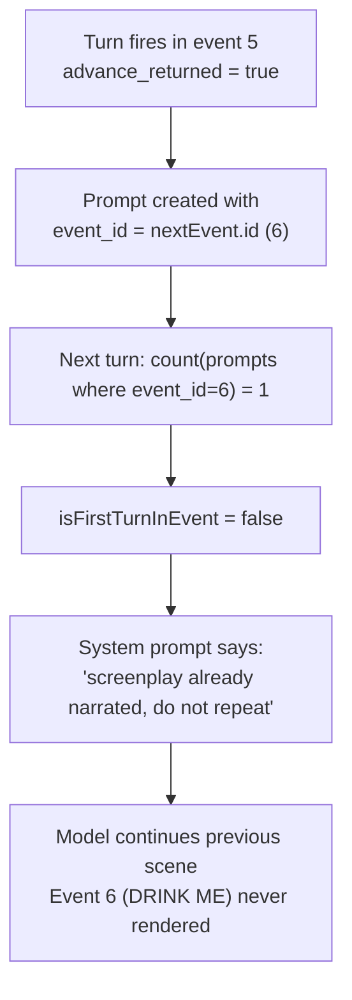

# Narration Fix Plan

## Root cause map




The fix is a one-line change in prompt creation, paired with a stronger scene-open signal in the system prompt.

---

## Change 1 — Fix prompt `event_id` assignment (root cause)

**File:** `[app/Http/Controllers/User/Game/PromptController.php](app/Http/Controllers/User/Game/PromptController.php)` — line 162

**Current:**

```php
$game->prompts()->create([
    'event_id' => $resolvedEventId,
    'response' => $aiResult['response'],
    'choices'  => $aiResult['choices'],
]);
```

**Change to:**

```php
$game->prompts()->create([
    'event_id' => $currentEvent->id,   // record the event being narrated, not the one advanced to
    'response' => $aiResult['response'],
    'choices'  => $aiResult['choices'],
]);
```

After this change: when event 5 → 6 advances, the prompt is recorded under event 5. The next turn counts 0 prompts for event 6, so `isFirstTurnInEvent = true` fires correctly.

`$resolvedEventId` is only used in this one place — no other side effects.

---

## Change 2 — Strengthen scene-open signal in system prompt

**File:** `[resources/views/ai/agents/narration/system-prompt.blade.php](resources/views/ai/agents/narration/system-prompt.blade.php)` — lines 282–284

**Current:**

```
@if(!empty($isFirstTurnInEvent))
This is TURN 1 of this event. You MAY narrate the CURRENT_EVENT screenplay...
```

**Change to:**

```
@if(!empty($isFirstTurnInEvent))
=== NEW SCENE — OPEN IT NOW ===
The story has moved to a new event. The previous scene is complete.
Your response MUST open the CURRENT_EVENT scene before anything else.
The conversation history shows the previous scene — that scene is over. Ignore its momentum.
Narrate the CURRENT_EVENT screenplay (as cinematic prose) up to the first natural decision point.
```

This makes the scene-open a hard directive, not a soft permission — which is what the model needs to override conversation history momentum.

---

## Change 3 — Off-script actions acknowledged before redirect (side quest intent)

**File:** `[resources/views/ai/agents/narration/system-prompt.blade.php](resources/views/ai/agents/narration/system-prompt.blade.php)` — lines 145–152

**Current:**

```
If the Player attempts something off-track:
- Integrate it as an in-scene attempt by Alice.
- Show believable character/environment reaction.
- Then present choices that guide back toward canon momentum.
```

**Change to:**

```
If the Player attempts something off-track:
- Honor the specific action they claimed — not just their general intent.
  If they said "I found a bottle and drank from it," acknowledge THAT act before grounding it
  in what actually exists. Never silently replace the player's claimed action with a different one.
- Follow the off-script thread for 1-2 turns if the player doubles down.
  Treat it as a side quest: give it real in-world consequence, let it breathe.
- Then let the scene's gravity naturally pull back toward the session's active events.
  The steering must feel organic — never abrupt, never a wall, never a named redirect.
- Choices should open a path back without naming the destination.
```

---

## Change 4 — Continue on active authored choice records the passive path

**File:** `[app/Http/Controllers/User/Game/PromptController.php](app/Http/Controllers/User/Game/PromptController.php)` — `store()` method, around line 47

After the current `$deterministicMatch` assignment, add a continue-fallback check:

```php
// existing
$deterministicMatch = $this->matchAuthoredChoice(
    playerInput: $isContinue ? '' : $prompt,
    sessionAdaptation: $sessionAdaptation,
);

// NEW — if continue and previous choices were an authored set, default to option C
if ($isContinue && $deterministicMatch === null) {
    $lastChoices = $game->prompts()->latest()->first()?->choices ?? [];
    foreach ($lastChoices as $choiceText) {
        $match = $this->matchAuthoredChoice((string) $choiceText, $sessionAdaptation);
        if ($match !== null) {
            // Previous turn served an authored branching choice — continue = passive path (C)
            $deterministicMatch = [
                'option'    => 'C',
                'choice_id' => $match['choice_id'],
                'text'      => (string) ($lastChoices[2] ?? $choiceText),
            ];
            break;
        }
    }
}
```

This means: if the player hits continue and the previous turn's choices matched an authored branching set, the system records option C (the passive/opportunistic path), narrates its consequence, and advances with the dimension recorded.

---

## Change 5 — Session close detection and injection

**File:** `[app/Http/Controllers/User/Game/PromptController.php](app/Http/Controllers/User/Game/PromptController.php)` — `renderSystemPrompt()`

Add detection: session close fires when the player is in the last 5 events of the session's range AND `$turnCount === 0` (first turn in that event):

```php
$isSessionEnd = false;
$sessionCloseDesign = null;

if ($sessionAdaptation?->session_close_design && $turnCount === 0) {
    $sessionEventRange = $sessionAdaptation->entry_point_diagnosis['session_event_range'] ?? null;
    if ($sessionEventRange) {
        [$rangeStart, $rangeEnd] = array_map('intval', explode('-', $sessionEventRange));
        $isSessionEnd = $currentEvent->position >= ($rangeEnd - 4);
    }
    if ($isSessionEnd) {
        $sessionCloseDesign = $sessionAdaptation->session_close_design;
    }
}
```

Pass `$isSessionEnd` and `$sessionCloseDesign` into the view. In `system-prompt.blade.php`, add a block inside the adaptation section (after the branching choices block):

```
@if(!empty($isSessionEnd) && !empty($sessionCloseDesign))
--- SESSION CLOSE ---
The session is reaching its end. When the current beat resolves naturally, deliver the
session close prose below, then present the SESSION-END CHOICE as the player's final decision.
Do not rush to it — wait for the scene's natural resolution point.

CLOSE PROSE:
{{ $sessionCloseDesign['resolution_prose'] ?? '' }}

HOOK:
{{ $sessionCloseDesign['hook_transition'] ?? '' }}

SESSION-END CHOICE:
{{ $sessionCloseDesign['session_end_choice']['choice_question'] ?? '' }}
A: {{ $sessionCloseDesign['session_end_choice']['option_a']['text'] ?? '' }}
B: {{ $sessionCloseDesign['session_end_choice']['option_b']['text'] ?? '' }}
C: {{ $sessionCloseDesign['session_end_choice']['option_c']['text'] ?? '' }}
@endif
```

---

## Files changed

- `[app/Http/Controllers/User/Game/PromptController.php](app/Http/Controllers/User/Game/PromptController.php)` — Changes 1, 4, 5
- `[resources/views/ai/agents/narration/system-prompt.blade.php](resources/views/ai/agents/narration/system-prompt.blade.php)` — Changes 2, 3, 5

---

## How to validate

1. Reset game (`step5`). Play one S1_C1 input. Hit `__continue`__. The narrator response must open the DRINK ME scene, not continue the hedgerow. This confirms Fix 1.
2. Type "I found a bottle and drank from it." The narrator must acknowledge the drinking act before redirecting. This confirms Fix 3.
3. Play up to turn 14 conditions. Hit `__continue_`_ when S1_C2 is shown. Check `narration.turn` log — `mapped_choice_id: S1_C2`, `mapped_option: C` must appear. This confirms Fix 4.
4. Play to event 19 area. Session close prose and S1_C3 identity question must appear. This confirms Fix 5.

